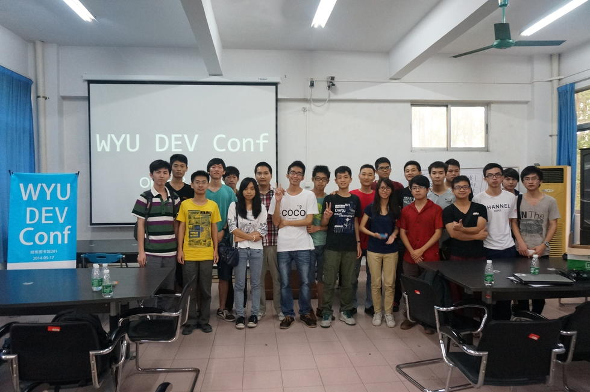
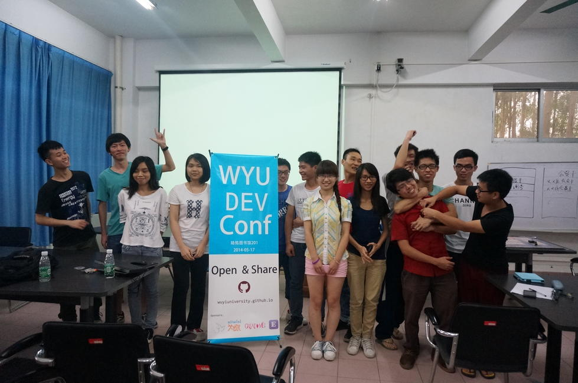

# 脚踏实地

*2014-05-21*

## 邑大开发者沙龙

若是没有英爷的积极推动，这两次开发者沙龙不可能顺利进行。
感谢英爷的付出，还有上台分享经验的，赞助我们的，到场交流的所有人，感谢你们。

我又一次接受了英爷的邀请，分享的依然是Nodejs方向，这次是构建工具Gulp。
以前端项目为例，介绍如何使用Gulp来自动化运行编译、监视、刷新等任务，加速开发。

看到剑伯他们开始关注Gulp，我感到很高兴。演讲也使我得到了锻炼，感谢英爷给我这个机会。

关于[本次开发者沙龙][2]，雄爷也写了一篇[精彩的博文][1]。

> 天啊！亮爷又坑了！两次演示都失败！我都替他晕菜了！
但是他还是讲的不错的.起码知道了coffcescript还有一些gulp跟xxx的对比！

拜托，前面的演示妥妥的，最后那段是观众批准后临时附加的，没有什么关系。

漂亮的合影：

更多照片：[百度云][3]

## 鼓励和挫折

近来真是悲喜交加。

喜，拖了很久的博客终于上线了，还做发布了[命令行工具silent][4]，供他人使用。

这是一套静态博客框架，我热爱它，因为它的纯净。
[昌哥][5]、[雄爷][6]、[伟涛][7]都开博客了，他们给予我支持，尤其是雄爷。
希望他们都能参与进来，一起发展这套博客框架。

在Gulp项目上，我无意间提出了一个[热门的议题][8]。大牛们的交流，给了成就感。

悲，将silent发布到cnode社区上，企图炫耀，但却无人问津，只换来了收藏+1。
没想到那些家伙对前端缺乏兴趣，或是看不惯这种[舍我其谁的语气][9]，我高估了他们的性情。

我的[Github账号][10]越来越光彩。我开始肆无忌惮地进攻那些热门项目，
毫不客气，却发现我的意见不再受人欢迎。

我开始审视自己。

1. 是我太嚣张了吗？是的，自从[鼓吹项目][11]、[鼓吹自己][12]后，我的言语变得轻狂。
1. 是我的发言太水了吗？是的，他们只希望在Github上看到关键的信息。
1. 是我太草率了吗？是的，贪图名利使我急于提出异议，而缺乏调查。

我应该落地了，消停一下，把东西再过一遍，做足了准备，再出手。记住教训，回归成长。

> 没有调查，就没有发言权。

脚踏实地，就先从脚踏稳了地面，一步一步走路开始吧。

[1]: http://jacsonlee.github.io/Blog/?Diary/wyu-dev-conf
[2]: https://github.com/WuyiUniversity/forum/issues/8
[3]: http://pan.baidu.com/s/1hqeK4ra#dir/path=%2FDEV_Conf_2014
[4]: https://github.com/fritx/silent
[5]: http://huangruichang.github.io
[6]: http://jacsonlee.github.io
[7]: http://iamjayden.github.io
[8]: https://github.com/gulpjs/gulp/issues/468
[9]: http://cnodejs.org/topic/537b6e29c3ee0b582000adc4
[10]: https://github.com/fritx
[11]: ../../projects.md
[12]: my-resume.md
