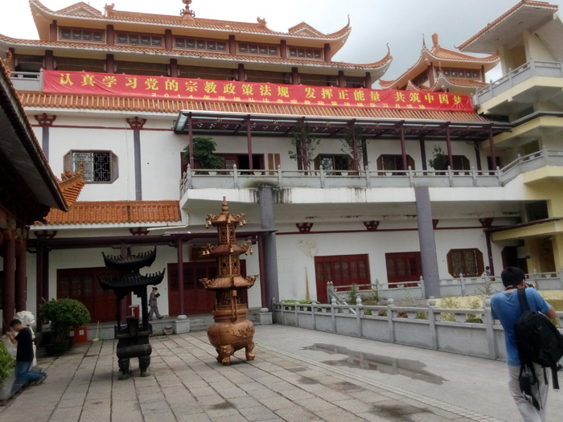
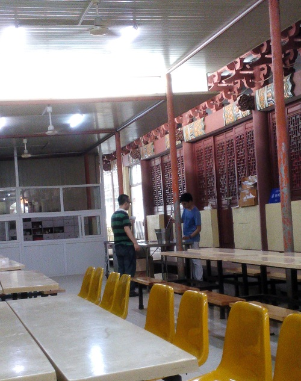

## 落后的呆瓜

*2014-06-05*

终于有机会跟方、李重聚了，地点仙湖。他们是我在深仅剩的俩死党了，真的。

是的，这是个坏消息，我**坦然接受**了。

几年前，我把这两个风格相当的死党介绍到一块，三人便经常一起行动。悲哀的是，由于个人[思想问题](../05/focus-or-radiate.md)，我和他们在共同话题上差距愈来愈大。而他们的默契，难以置信地忽略了这些。

过去，我陪他们逛华强北、电子城，对电子科技的熟知度望尘莫及。今天，他们更谈政治、旅游、影视、哲学、性爱，我是个局外人。当然，这里面有个过程，但我是**从没改变**的那个。

我落后了，我一直都很落后。方却一本正经地说：“没必要，你还是多把心思放在IT方面。”这颇像大人对小孩说：“大人的事小孩别管，好好念书吧。”确实，无意中恰恰给了我这个“没长大的小孩”一分安全感，但我知道，我不能要。

我需要反思，我需要努力。我爸的知识面很广，可我却一点没像他。人，不一定一代比一代强啊。

你知道吗，这次出行，唯一令我感到和他们**节奏相同**是在什么时候？答，是我们在弘法寺点香的那一刻。遵守礼仪，我们接过了香柱，拿了香柱总得上香吧。面对炽热的火烛和呛鼻的香气，我们秉着呼吸，点起香来。那短短的半分钟，无论是否虔诚，三人平心静气，对我而言，像是回到了那个遥远的起点，我们三个还是平等的，平等的……

&nbsp;&nbsp;
