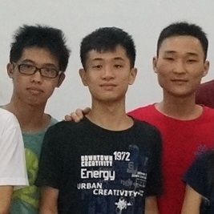

# 我的拉勾网简历

*2014-08-17*

<link rel="stylesheet" type="text/css" href="lagou.css">

<h1 title="林亮的简历">林亮的简历</h1>

<h2>基本信息</h2>

林亮 | 
男 |                     本科 |                                      应届毕业生
| 深圳 
本科 · 五邑大学 
186\*\*\*\*6196 | uxfritz@163.com 

<h2>期望工作</h2>

深圳，实习，月薪2k-5k，web前端

<h2>项目经验</h2>

<ul class="plist clearfix">
<li>

江门邮政电商，web前端

（2014.07-至今）

继greatme后，工作室与江门邮政联手微信电商，正在线运营 ( http://www.jmyzds.com/store ) 。web前端人员仅一名。前端代码开源：https://github.com/fritx/emshop

</li>
<li>

GreatMe校园卫生巾专卖，web前端

（2014.03-至今）

校内学生创业项目，面向女生的卫生巾专卖，基于微信平台推广，正在线运营 ( http://greatme.org ) 。现已获广东省金奖。web前端人员仅一名。前端代码开源：https://github.com/fritx/mshop

</li>
<li>

江门社保局内部管理系统，web前端

（2013.06-至今）

市级政府系统，由学院承接，教授领导，在读硕士、本科生开发。内容主要是表单、列表以及图表。web前端人员共两名。前端代码开源：https://github.com/phrief/jmsis

</li>
<li class="noborder">

思源校友群App，web后端

（2013.12-2014.03）

面向西安交大校友的Android应用，工作室承接。web后端采用新兴的node.js，后端人员共3名。现已截止。后端代码开源：https://github.com/node-fun/siyuan

</li>
</ul>

<h2>教育背景</h2>

<ul class="elist clearfix">
<li class="clear">
2011-2015

<h3>五邑大学</h3>
<h4>软件工程，本科</h4>

</li>
</ul>

<h2>自我描述</h2>

像素主义、完美主义、强迫症。热衷编程，工作狂。爱好步行、跑步。

<h2>作品展示</h2>

<ul class="slist clearfix">
<li>

<a href="https://github.com/3dobe/yjjapp" target="_blank">https://github.com/3dobe/yjjapp</a>

演讲家App，宿舍室友合作完成的参赛作品，适用活动现场互动 

</li>
<li>

<a href="https://github.com/fritx/wyu-sing" target="_blank">https://github.com/fritx/wyu-sing</a>

邑大校园唱吧微信平台版（现已下线） 

</li>
<li>

<a href="https://github.com/3dobe/freeblog" target="_blank">https://github.com/3dobe/freeblog</a>

轻量级个人博客框架，宿舍室友合作完成的课程设计作品 

</li>
<li>

<a href="https://github.com/fritx/silent" target="_blank">https://github.com/fritx/silent</a>

发布在npm上的“静态博客”模板工具 

</li>
<li class="noborder">

<a href="http://fritx.github.io/sites/bec" target="_blank">http://fritx.github.io/sites/bec</a>

BEC：深圳商擎顾问有限公司主页（模板） 

</li>
</ul>

