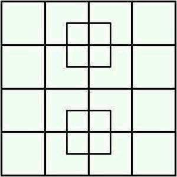
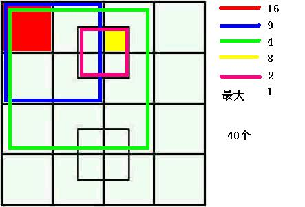
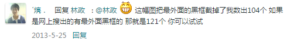

# 有多少个正方形？

*2014-11-12*

## 问题

> 你能从图片中数出多少个正方形？

## 一般的答案

> 按从小到大整理，8 + (16 + 2) + 9 + 4 + 1 = 40

## 我的答案

显然，题目的本意是希望我们数出尽可能多的正方形。

（直至开始写作为止）我的想法是：线段是有笔直的、有宽度的，因此，在原有的基础上，40个正方形都可以有“有边框”和“无边框”两种状态，并且图中的41个“节点”也都是一个正方形。

因此，答案变成了 **40 * 2 + 41 = 121**

## 结语

- 我没有查阅太多资料，因此并不了解其相关的讨论及“标准答案”。

- 我把我的想法分享出来，只想说明：**我们有能力、有理由以及有权利“跳出圈子”思考问题，追求极致**，而非人云亦云，迷信权威和标准。

- 正因为此，所以我深信并无完美，属抛砖引玉，期待欢迎指正和交流。

- 其实这是我一年半前的解法了，只可惜数字还是没变。

## 相关链接

- http://tieba.baidu.com/p/2101028119
