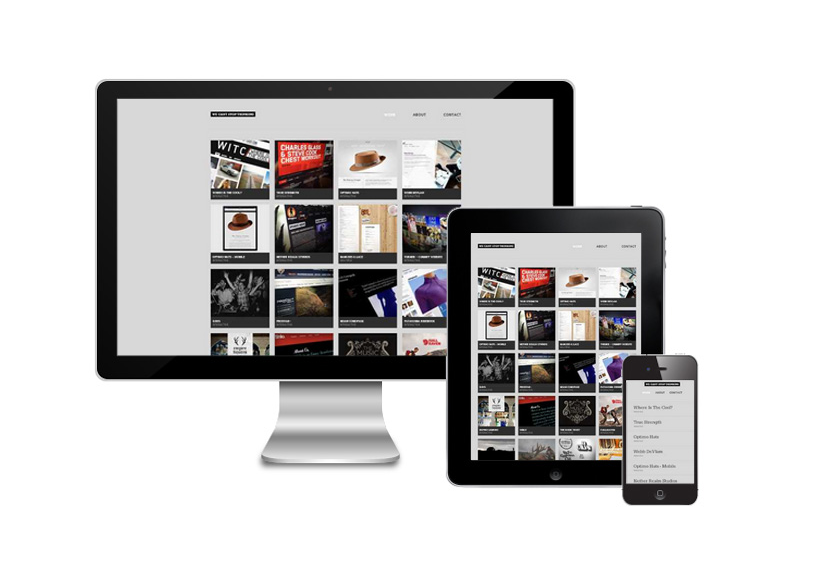
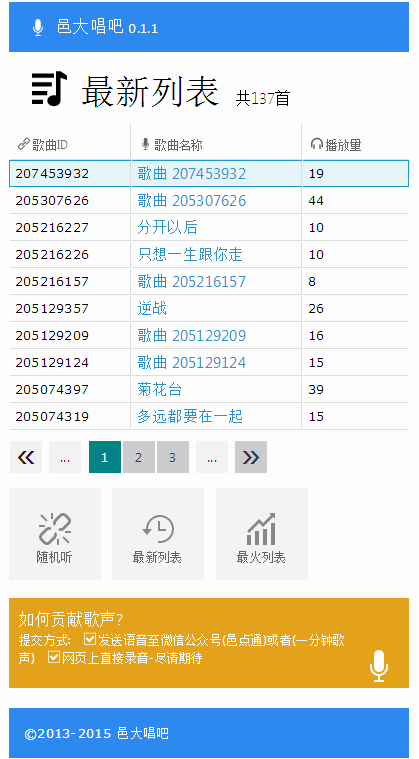
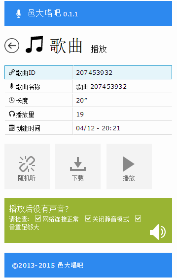
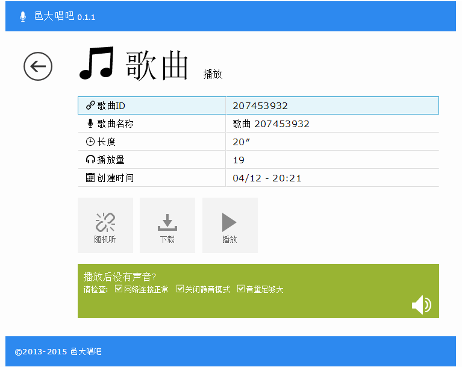
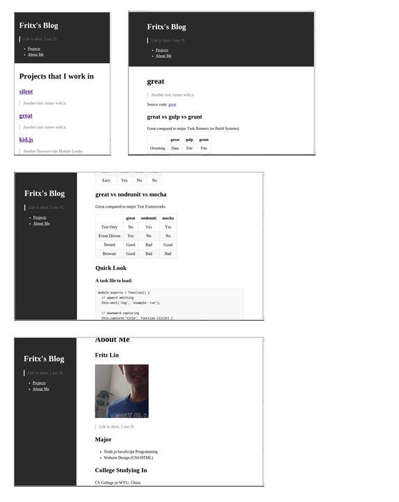
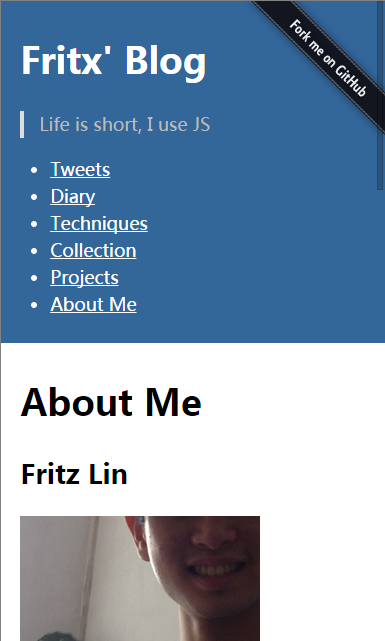

# 响应式设计之路

*2015-04-20*

我从小学开始接触web设计，初一开始参赛，至今已有10年web开发经历，自认为对web有一定见解。

## 响应式由来，概述，现状

> 响应式网页设（RWD）是[Ethan Marcotte在去年5月份提出的一个概念](http://alistapart.com/article/responsive-web-design)，简而言之，就是一个网站能够兼容多个终端——而不是为每个终端做一个特定的版本。这个概念可以说是是为移动互联网而生的！

（摘自：[响应式网页设计 - 前端观察](http://www.qianduan.net/responsive-web-design/)）

- [国内优秀的响应式WEB网站有哪些？ - 知乎](http://www.zhihu.com/question/21073212)

### 屏幕尺寸分类

- 767px及以下：超小屏幕（xs），手机
- 768px~991px：小屏幕（sm），平板
- 992px~1199px：中屏幕（md），桌面
- 1200px及以上：大屏幕（lg），大桌面

（摘自：[bootstrap栅格系统](http://v3.bootcss.com/css/#grid>)）

### 适配方向

- 小屏 << 中屏 << 大屏
- 小屏 >> 中屏 >> 大屏（移动优先）
- 小屏 << 中屏 >> 大屏

### 响应分级

- 基础响应式：内容完整呈现
- 进阶响应式：+基本美感协调
- 高级响应式：+全方位+人性化+强设计

## 响应式设计模式

- 高宽伴随/设限
- 流式/百分比
- 字体大小
- 边距/留白
- 列数增减
- 板块排布
- 部件改编
- 渐进协调

### 高宽伴随/设限，边距/留白，字体大小

&nbsp;&nbsp;&nbsp;&nbsp;

&nbsp;&nbsp;&nbsp;&nbsp;

（演示：[邑大唱吧](http://1min.fritx.me)，源码：[fritx/1min](https://github.com/fritx/1min)）

### 流式/百分比，板块排布

（摘自：[silent博客框架](https://github.com/fritx/silent)，演示：[Fritx' Blog](http://fritx.github.io/blog/)，源码：[fritx/blog](https://github.com/fritx/blog)）

### 列数增减

&nbsp;&nbsp;&nbsp;&nbsp;

（演示：[深圳商擎顾问](http://fritx.github.io/sites/bec/)，源码：[fritx/sites](https://github.com/fritx/sites)）

### 部件改编

&nbsp;&nbsp;&nbsp;&nbsp;

&nbsp;&nbsp;&nbsp;&nbsp;

### 渐进协调

## 谢谢！

- [《响应式设计之路》博客原文](http://fritx.github.io/blog/?2015/04/respdesign/)
- [《响应式设计之路》演说幻灯片](http://fritx.github.io/blog/p/2015/04/respdesign/index.md.html)

## 拓展阅读

- [国内优秀的响应式WEB网站有哪些？ - 知乎](http://www.zhihu.com/question/21073212)
- [5 Really Useful Responsive Web Design Patterns](http://designshack.net/articles/css/5-really-useful-responsive-web-design-patterns/)
- [Responsive Web Design Patterns](https://developers.google.com/web/fundamentals/layouts/rwd-patterns/mostly-fluid?hl=en)
- [##响应式设计## - 在线云频道](http://channel.fritx.me/channels/ca4a1e99-65da-48de-9195-2a8cebfdb9a9)
