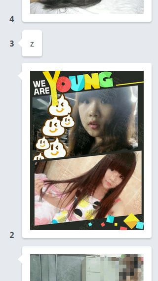
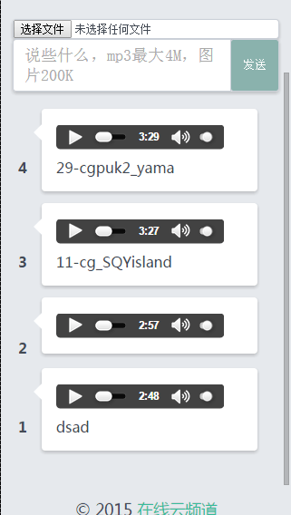
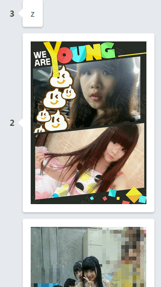
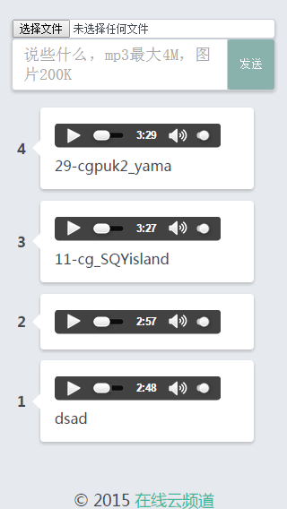
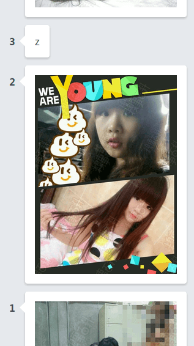
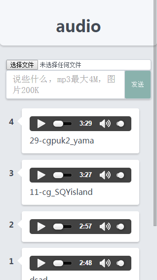
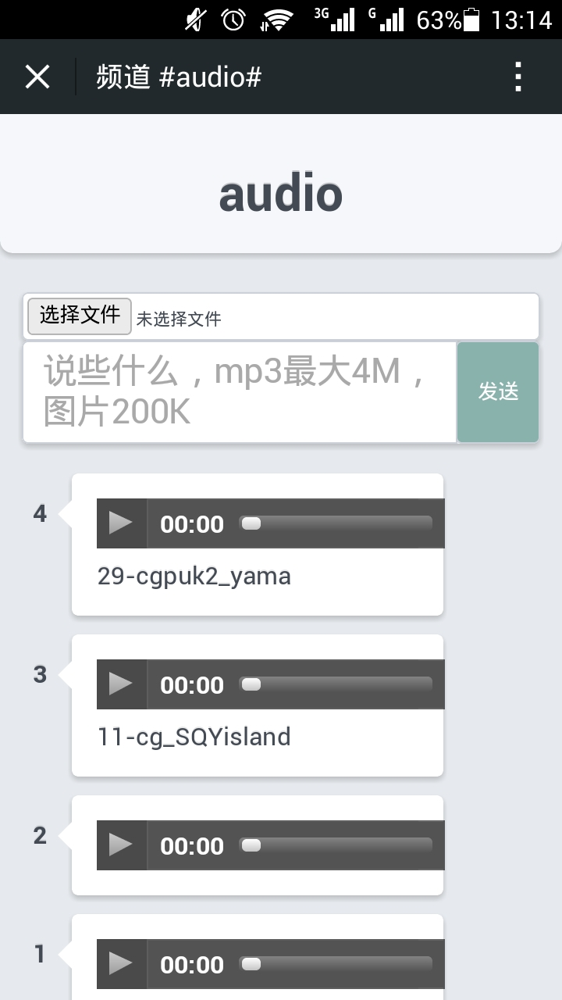
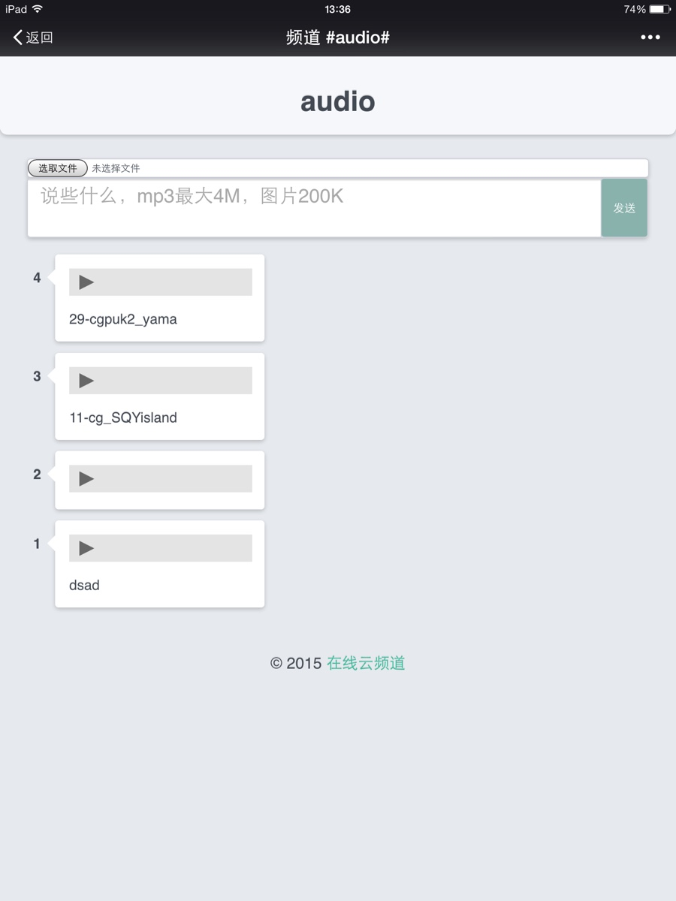

# 跟我一起来升级#在线云频道#（1）

*2015-05-02*

> [#在线云频道#][1]，是继承自[#微信话题墙#][2]创意的又一尝试。

除了#频道#的概念更具通用性，两者功能相当，包括如下几种使用场景：

- 话题议论（发起一场议论）
- 意见征集（班干选举，旅游地投票等，都可线上解决）
- 匿名交流（频道推崇匿名玩法）
- 群组减负（将群组中的支线信息导向频道）
- 信息粘贴（临时的信息传递）
- 专栏创作（持续发布某类信息）

OK，白日梦做完了，让我们一起来改善代码吧。

## 楼层数显示位置的纠结

我使用外层display:table，内层table-cell的方式，实现自动收缩，自动偏移的评论气泡效果。另外，使用内部绝对定位的:before伪元素，实现了一个箭头。完整代码位于[channel-view.hbs][3]，[channel-view.less][4]。

```html
<li>
  <div><label>{{floor}}</label></div>
  <div><article></article></div>
</li>
```

```less
li {
  // 自动收缩，自动偏移的评论气泡效果
  display: table;
  >div {
    display: table-cell;
  }
}
article {
  position: relative;
  &:before {
    position: absolute;
    top: 17px; // 偏上
  }
}
```


&nbsp;&nbsp;&nbsp;&nbsp;&nbsp;&nbsp;


但是，楼层数碰见了带图片或音频的评论就傻了。


&nbsp;&nbsp;&nbsp;&nbsp;&nbsp;&nbsp;


我尝试将楼层数和箭头垂直居中。

```less
li {
  // 自动收缩，自动偏移的评论气泡效果
  display: table;
  >div {
    display: table-cell;
    vertical-align: middle; // 居中
  }
}
article {
  position: relative;
  &:before {
    position: absolute;
    //top: 17px; // 偏上
    top: 50%; // 居中
    margin-top: -9px; // 居中
  }
}
```

但对于特别长的评论，就显得有些奇怪。


&nbsp;&nbsp;&nbsp;&nbsp;&nbsp;&nbsp;

&nbsp;&nbsp;&nbsp;&nbsp;&nbsp;&nbsp;


于是，我决定取消垂直居中，强行实现原本top:17px的效果。

```less
li {
  // 自动收缩，自动偏移的评论气泡效果
  display: table;
  >div {
    display: table-cell;
    //vertical-align: middle; // 居中
    vertical-align: top; // 偏上2
  }
}
label {
  padding-top: 16px; // 偏上2
}
article {
  position: relative;
  &:before {
    position: absolute;
    //top: 17px; // 偏上
    //top: 50%; // 居中
    //margin-top: -9px; // 居中
    top: 17px; // 偏上2
  }
}
```


&nbsp;&nbsp;&nbsp;&nbsp;&nbsp;&nbsp;

&nbsp;&nbsp;&nbsp;&nbsp;&nbsp;&nbsp;


## 解决audio宽度溢出hack

之前，我为audio设了个320px下能容纳的最大宽度。完整代码位于[channel-view.less][3]。

```less
>audio {
  // note: chrome模拟器320px下，4位数楼层，最大宽度
  max-width: 206px;
}
```

max-width前后， chrome模拟器上对比：


&nbsp;&nbsp;&nbsp;&nbsp;&nbsp;&nbsp;


我很发现我的android上，audio的meta信息加载完毕后，会有宽度溢。
因此我用css3将其缩放。

```less
>audio {
  // note: chrome模拟器320px下，4位数楼层，最大宽度
  max-width: 206px;
  transform-origin: left top;
  // note: android下scale(.9)
  transform: scale(.9);
}
```

scale(.9)前后，android上对比：


&nbsp;&nbsp;&nbsp;&nbsp;&nbsp;&nbsp;


然而，这次我发现ipad上，宽度依旧溢出，因此继续缩小。

```less
>audio {
  // note: chrome模拟器320px下，4位数楼层，最大宽度
  max-width: 206px;
  transform-origin: left top;
  // note: android下scale(.9)，ipad下.8才能不溢出
  //transform: scale(.9);
  transform: scale(.8);
}
```

scale(.8)前后，ipad上对比：


&nbsp;&nbsp;&nbsp;&nbsp;&nbsp;&nbsp;


## 下期预告

跟我一起来升级#在线云频道#（2）：

- route更名及向下兼容
- 框组按钮高度自适应hack

[1]: https://github.com/fritx/channel
[2]: https://github.com/fritx/wxtopic
[3]: https://github.com/fritx/channel/blob/master/src/web/channel-view.hbs
[4]: https://github.com/fritx/channel/blob/master/src/web/channel-view.less
