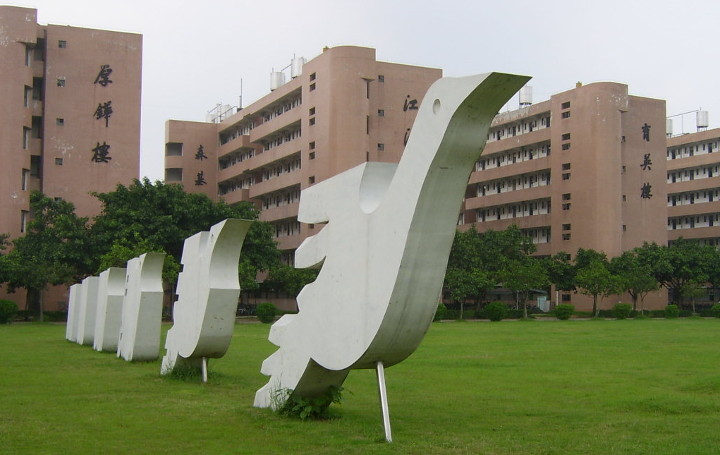
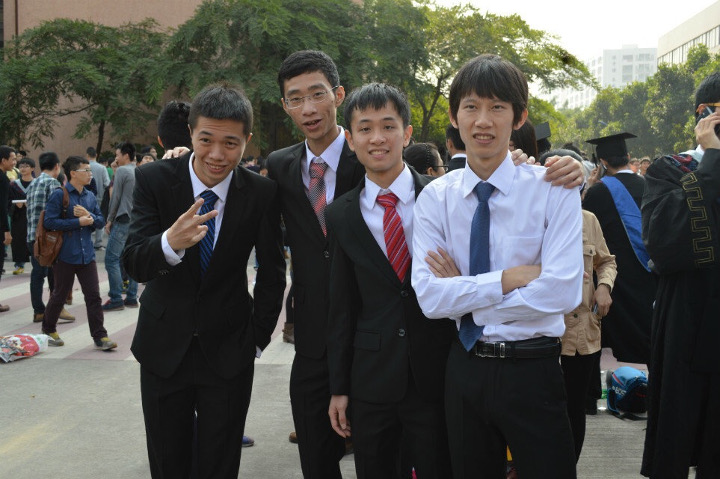
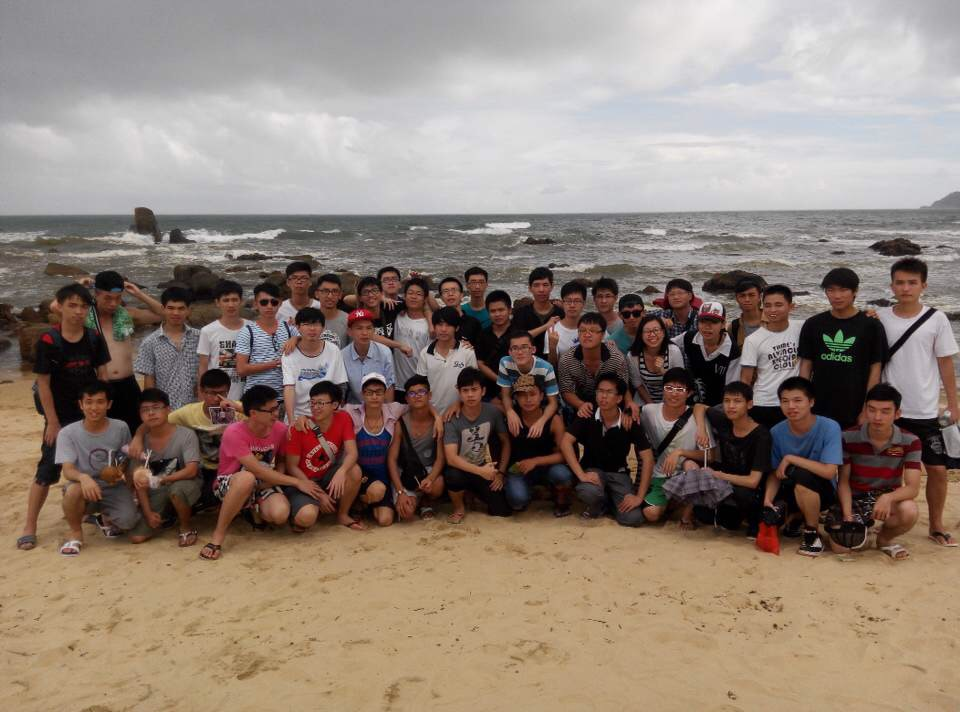
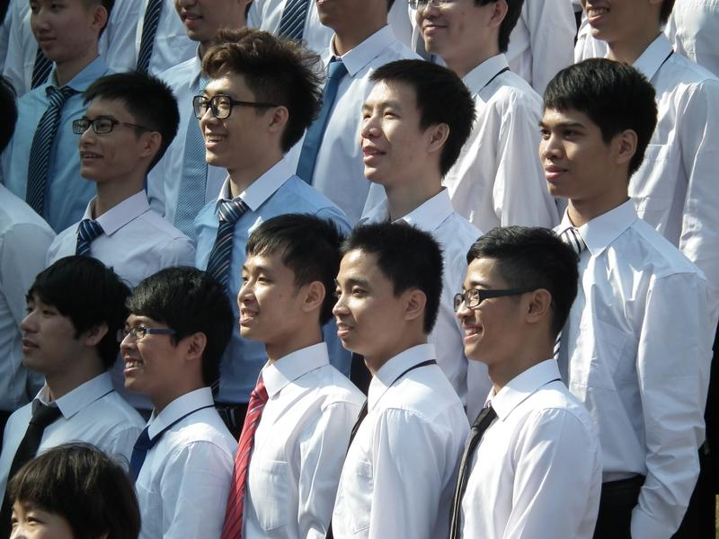

# 亮爷的毕业致谢

*2015-06-06*

在我的毕业论文即将完成之际，我想要好好地感谢，感谢那些陪伴过我、支持过我的人。

感谢我的父母，感谢你们对我充满信心，尊重并且支持着我的决定，还有就是朋友般无话不谈的沟通方式，让我在家中也能够吹牛和释放自己。

感谢我的母校五邑大学，是你收留并孕育了我，如今的我会自豪的说出：我是邑大人。感谢在这里教育过我的老师们，感谢我的班导曹彩凤老师。感谢16栋，育英楼。

感谢我的指导老师王柱老师，在您的指导下我们最终攻克了毕业设计及文论；也是您，两年前带领我们加入社保项目组，开启了我们的打工之路。

感谢社保项目组的易院长、刘老师、吴老师、师兄师姐们，有你们关照真好，我很想念那个顶着绵绵细雨，跨越大半个校园才能来到的研发室。

感谢剑剑，没有你，锐斧小组不会加入袂卓工作室；没有你，就没有思源项目的整个过程。在袂卓我们收获了太多。对了，深圳码农周末等你归来。

感谢智峣和涌鑫，每当看见卫生巾和月饼我就会想起你们。做闺蜜专卖、江门邮政商城很艰辛，却也很快乐，它们永远是我心目中最可爱的产品。感谢袂卓的所有小伙伴。

感谢英爷，没有你，也就没有当年的邑大唱吧；没有你，就没有先后三次的邑大开发者沙龙。感谢多次给我平台并认可我。我在外头等你一年。

感谢雄爷，跟你探讨过无数次技术还有人生。你是我最早的支持者，给予我莫大鼓励。你热血、快言快语，最重要是够酷！我等你两年。

感谢陪伴了我四年的室友3dobe们，还记得当初的宿舍口号吗？那些挥之不去的想法，那些引以为傲的作品。我们曾在一个屋檐下奋斗过。感谢班上的同学们，你们的友爱，让我快乐成长；你们的猥琐，只会让我更懂生活。四年同窗，祝好。

感谢洪比，你是人生导师，伴我游走及启发我次数最多的人。玩世不恭的脸蛋与你那睿智深远的心境相矛盾。我向往你那不为现实所屈的性格。

最后，我要感谢昌爷。从当年我们的锐斧小组，到现在的深圳码农周末，你是那个陪我写过最多代码、打过最多次球、说过最多笑话、交换最多想法的人。一直以来，我们两人具有最大的反差，我避讳，你直白；我纠结，你果敢；我猴急，你迟缓；我强迫，你却又随性。但我们一路这么走来，还要继续走下去，也许这就是最好的拍档吧。

