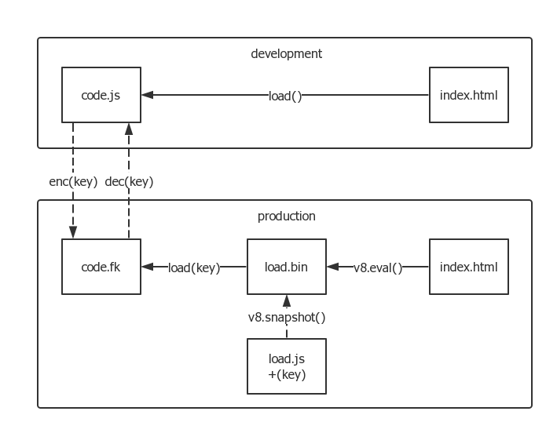

# nw.js代码保护术

*2016-01-17*


## JS安全

伴随着node.js、nw.js、cordova、react-native等技术的发展，JS的适用范围增大，前端、后端、移动端、桌面端，商业性运用也在扩大。

JS代码保护这一瓶颈将逐渐显露，“JS安全”将成为下一代火爆的话题。


## 研究背景

> 兵来将挡，水来土掩。

我们IT部基于nw开发桌面应用，供公司内部使用。然而，某些部门竟然“勾结”，硬是看代码找茬，还拿了奖金。


不就是看不惯我们用node.js吗？嘿嘿嘿。

既然如此，我们只好开脑洞，想办法保护代码了。


## nw应用的基本文件结构

```plain
- nwapp
  - dist/
   - bundle.js
  - index.html
  - package.json
```

nw启动时，解析package.json，访问页面index.html，继而加载bundle.js。

我这里以打包bundle为例，即一个html页面对应仅有一个入口js文件。

如果你的项目不是，也没关系，方法类似。


## 那么，如何保护代码呢？

以下是一些手段罗列：

- uglify 常规压缩
- gulp-obfuscate这类 肉眼混淆
- eval混淆 (可逆)
- jsfuck (可逆, 膨胀厉害)
- bundle打包 混淆效果增强
- fs-auth这类 通过key加/解密 (有key则可逆)
- v8.snapshot 代码快照/加载 (在nw中可使用)

其中eval、jsfuck暂时用不上；而gulp-obfuscate所产生的特殊字符，我们项目中的nw0.12.3又尚不兼容。




如上图所示，我们在发版构建过程完成以下任务即可：

1. 将code.js加密为code.fk

  ```js
  // tool/pack.js
  buf = read('code.js')
  buf = enc(buf, key) // 根据key加密
  write('code.fk', buf)
  ```

2. 将用于调取code.fk的load.js快照为load.bin

  ```js
  // src/load.js
  buf = read('code.fk')
  buf = dec(buf, key) // 根据key解密
  script.innerHTML = buf.toString() // 运行
  ```

  ```plain
  $ nwjc src/load.js dist/load.bin
  ```

3. 最后保证index.html调取load.bin

  ```html
  <script src="dist/bundle.js"></script>
  <script>
    require('nw.gui').Window.get().evalNWBin(null, 'dist/load.bin')
  </script>
  ```

  这里我直接偷懒，把dev/prod各自用到的写在一起了，一份html两种环境都能跑。

这样就保证了业务逻辑code.js，以及调取逻辑load.js都被加密了，攻击者无法获得看明文代码。


## 打开控制台？

> 想搞我？弄死你！

package.json中window.toolbar字段关乎console可否被打开；再者，攻击者也可以篡改（唯一暴露的）index.html，加入打开console的命令。

咋整？

这时候key就派上用场了，key不是死的字符串，而应该是一个算法。

我们将key设定为依赖某些即时环境因素，如package.json及index.html的md5值。

```js
key = [
  md5(read('package.json')),
  md5(read('index.html')),
].join('')
```

这样，他们就动不了这两个文件了，否则直接跑不起来。

另外，如果更加保险，也可以尝试重写/反重写方法，或判断console打开然后“下手”，以牙还牙。


## script标签 v.s. require()

这里以`<script>`加载主逻辑为例，假如你用的是`require()`，也没关系，方法类似。

在nw中，这两种用法本身确实是有一定区别的。


## 这个还是可以hack的

md5那关还是可以hack的。

而且，要是对方自己定制一个nw来运行，也是没有办法的。

这个以后可以再聊。

但我已经要用这个来对付那帮傻x了！


