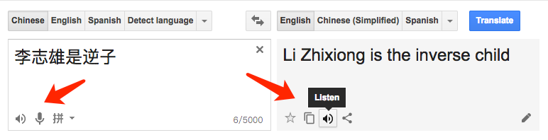
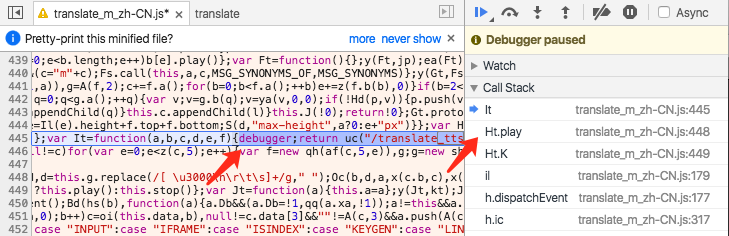
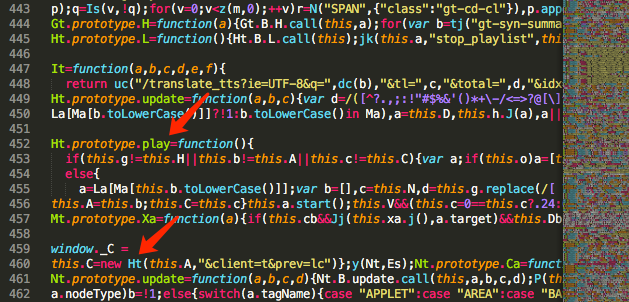
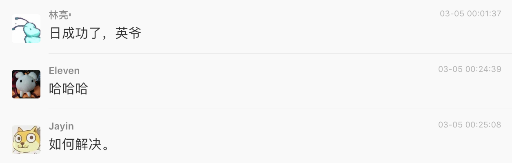
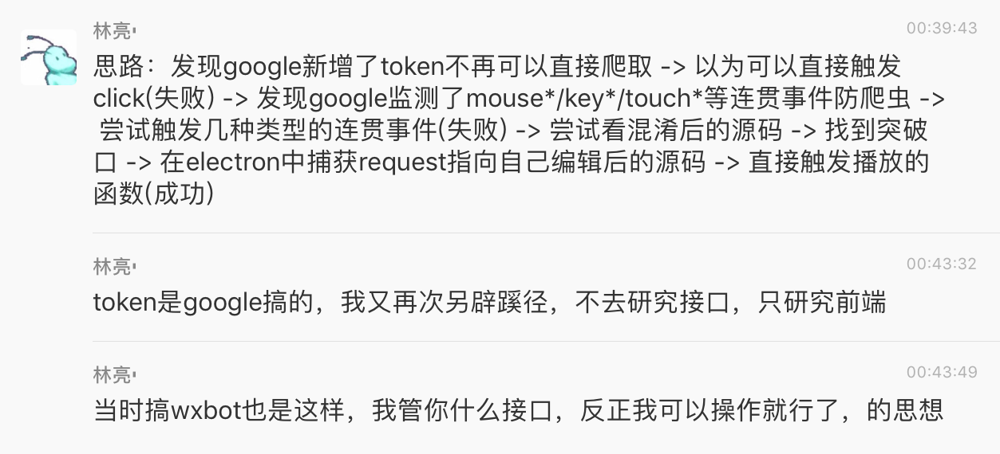

<style>
audio {
  vertical-align: middle;
}
</style>

# 绕过Google反爬虫技术，实现人声音频抓取

*2017-03-05*

**Google翻译的朗读功能**



> Type text or a website address or translate a document.<br>
> -- *https://translate.google.cn/*

**“空间大战”游戏中人声播报**

我13年的作品“spacewar”中，人声播报就是来自于Google翻译的朗读功能。我精心设计了奇怪的英文词组，使其朗读出来像是美国口音在说中文，形成有趣且高逼格的游戏效果。

- <audio controls src="welcome.mp3"></audio> “欢迎来到空间大战，碾碎他”

- <audio controls src="injure.mp3"></audio> “受到攻击”

- <audio controls src="kill.mp3"></audio> “击杀目标”


> 3d的飞船射击游戏，与npc混战，键盘W/S/A/D/R/F前后左右升降，鼠标控制视角，点左键射击。进入即玩，刷新再来。背景音乐，物理音效，语音播报。<br>
> -- *[fritx/spacewar](https://github.com/fritx/spacewar) (May 2013)*

**Node.js库：get-voice**

不管是我14年写的get-voice，还是英爷的Voice-Editor，无非都是“无耻”地抓取了Google翻译的人声音频，以为己用。

但是后来我也发现不能用了，因为mp3的请求路径加入了token参数，而相关的逻辑又被打包在庞大的JS文件中，以我的智商难以破解。可见Google后来发威了，决定整治恶意爬取的风气。

```js
// 以前的路径
'/translate_tts?ie=UTF-8&q=hello'

// 加入了token后的路径
'/translate_tts?ie=UTF-8&q=hello&tk=639685.1019280'
```

由于当时也没这方面需求，于是放了一下，结果这一放就是两年半。

> Get human voice from translate.google.cn<br>
> -- *[fritx/get-voice](https://github.com/fritx/get-voice) (Oct 2014)*

> 发声文本编辑器<br>
> -- *[Jayin/Voice-Editor](https://github.com/Jayin/Voice-Editor) (Mar 2015)*

**为什么是“translate.google.cn”，而不是“translate.google.com”？**

在页面内容基本一致的情况下，“google.com”需要翻墙，不是每一台机器都能翻墙，比如我的VPS就没有，因此，为了可用性，我选择的是“cn”。

> Thanks a lot @truerenton<br>
Btw, would u mind I use translate.google.cn?<br>
google.com is blocked in China, damn...<br>
> -- *https://github.com/fritx/get-voice/pull/1#issuecomment-59535210*

## 前端模拟利器：Electron

这个想法很早就有了，只是一直没时间搞。基于Electron或是Nightmare，可以轻松实现对前端操作的模拟。

```js
win = new BrowserWindow()
win.loadURL(url)

wc = win.webContents
wc.executeJavaScript(`
  // code to inject
`)
```

```js
input = document.querySelector('#source')
input.value = '李志雄是逆子'

btn = document.querySelector('#gt-src-listen')
btn.click()
```

然而，语音请求并未发出。

## 猜想成立，惊现连贯事件监听防护策略

打开控制台查看绑定在播放按钮的“Event Listeners”：


果然，精明的Google并非监听单个事件，而是监听一系列连贯的事件，并进行一些记录及校验，进一步鉴别及屏蔽机器人操作，而非人类。

在校园时，我曾分享过一个观点。如何反爬虫？

> 除了验证码，那些什么`Referer`、`UserAgent`、`CSRF`，无一不是基于冰冷的数理逻辑，我不看好，Electron机器人可以轻松模拟。

> 机器人和人比最缺什么？缺的是活生生的肉体啊。

> 人类浏览网页时，身体的各个部位是在活动的，当他们鼠标移动时，轨迹是会抖动的，当他们敲击键盘时，时间间隔是不定的。甚至他们的瞳孔、他们的心跳，都是在时刻变化的。

> 所以反爬虫系统，可以试图从人文、生命的角度去加多一道防线。毕竟，要模拟这一系列生理特征，所对应的事件输入，对于机器人来说，爬取门槛被提升了一个level。

Google的这种做法，印证了我的早前的猜想。


## 不服输，尝试触发连贯事件

既然知道了Google有监听这么多事件，那我就来尝试触发个遍。

“dispatchEvent”我之前在nw-auto中也有实践过：<br>
https://github.com/fritx/nw-auto/blob/d5d8c8541c64f20b41e7b4c18fe07cb03c9ca149/test/__chat.js#L89-L92

```js
btn.dispatchEvent(e) // focus
btn.dispatchEvent(e) // keydown
btn.dispatchEvent(e) // keypress

e = document.createEvent('KeyboardEvent')
e.initKeyboardEvent('keyup', true, true, window)
e.keyCode = 13
btn.dispatchEvent(e)
```

```js
btn.dispatchEvent(e) // mouseover
btn.dispatchEvent(e) // mousedown

e = new MouseEvent('mouseup', { // mouseup
  bubbles: true,
  cancelable: true,
  view: window
})
e.clientX = btnX // btn中点坐标
e.clientY = btnY
btn.dispatchEvent(e)
```

> 更多关于dispatchEvent的参考资料：

> - https://github.com/vuejs/vue/blob/056cb7f295502407694b8b22c09a6e38fff0e61e/test/helpers/trigger-event.js
- [Simulating a mousedown, click, mouseup sequence in Tampermonkey?](http://stackoverflow.com/questions/24025165/simulating-a-mousedown-click-mouseup-sequence-in-tampermonkey)
- [MDN: MouseEvent - Example](https://developer.mozilla.org/en/docs/Web/API/MouseEvent) 

我甚至尝试了Electron的sendInputEvent，参照了https://github.com/electron/electron/issues/3072#issuecomment-147663843 中的写法，触发键盘系列事件。


```js
keyCode = '\u000d' // RETURN
wc.sendInputEvent({ type: 'keyDown', keyCode })
// type不支持'keyPress'
wc.sendInputEvent({ type: 'keyUp', keyCode })
wc.sendInputEvent({ type: 'char', keyCode })
```

依然没有成功。

## 篡改源码，暴露引用

我没有放弃。我把页面从桌面版，切至移动版。移动版依然有朗读功能，样式布局及代码长度应该会更简单便于操作。

> Touch to type.<br>
> -- *https://translate.google.cn/m/translate*

源码uglify过，我想快速搜寻关键信息，比如音频URL的拼接：

```js
It=function(a,b,c,d,e,f){
  return uc("/translate_tts?ie=UTF-8&q=",/* ... */)
}
```

我尝试加断点观察点什么，意外发现调用栈中出现一个“play”方法。因为uglify的时候，挂在对象上的属性名，是不会被缩短的。



我猜这个play已经是那一系列校验以后的事情了吧？于是我决定篡改代码试一试。如果直接调用这个play，说不定就可以直接播放了。

translate_m_zh-CN.js中的突破口：



劫持请求，重定向到篡改后的本地JS文件：

```js
wr.onBeforeRequest((details, callback) => {
  let redirectURL
  // /translate/releases/twsfe_w_20170227_RC00/r/js/translate_m.js
  // /translate/releases/twsfe_w_20170227_RC00/r/js/translate_m_zh-CN.js
  if (details.url.includes('/r/js/translate_m')) {
    redirectURL = `file://${__dirname}/translate_m_zh-CN.js`
  }
  callback({ cancel: false, redirectURL })
})
```

页面加载就绪后。直接调用暴露出来的play方法。

```js
wc.executeJavaScript(`
  window._C.play()
`)
```

语音成功播放。至此，破解工作已经完成。



## 保存音频到本地

剩下来的就是文件下载的收尾工作了。这里是我一个惯用的路数，创建一个带download属性的a标签，并触发click。我在wxbot中也有用到，用来下载用户的语音消息。

捕获mp3请求，并触发session文件下载：<br>
https://github.com/fritx/wxbot/blob/26f0571ac849f2add21ff791a955e4cc7c026ef0/preload.js#L148-L151

```js
if (!isDownloading && details.url.includes('/translate_tts?')) {
  isDownloading = true
  let voiceUrl = details.url
  let saveName = `${text}.mp3`
  saveName = sanitize(saveName) // 过滤危害字符

  wc.executeJavaScript(`{
    let a = document.createElement('a')
    a.href = ${jstr(voiceUrl)}
    a.download = ${jstr(saveName)}
    a.click()
  }`)
}
```

捕获session文件下载，并保存到本地：<br>
https://github.com/fritx/wxbot/blob/26f0571ac849f2add21ff791a955e4cc7c026ef0/index.js#L34-L52

```js
sess = session.defaultSession
sess.on('will-download', (e, item) => {
  let filename = item.getFilename()

  if (filename.endsWith('.mp3')) {
    console.log('准备下载语音', item.getFilename())
    item.setSavePath(`./voice/${filename}`)

    item.on('done', (e, state) => {
      console.log('语音下载结束', state)
      isDownloading = false
    })
  }
})
```

接下来，我们把Electron跑在服务器上，就搭建了获取人声的Node.js服务了。<br>
配置参照 https://github.com/segmentio/nightmare/issues/224#issuecomment-141575361

关于Google封恶意IP，我想请求量和频次不大的话，应该不会轻易触犯吧？起码我自己的需求量不会。

## 结束语

昨天打了一天的篮球，晚上花了3小时，从发现到解决难题，一路走下来，使出了浑身解数。说明运动的确是有思考的。

~~刚入学的时候我搞学校，爬取学生证件照、[抓取学生资料/课程表/学分](https://github.com/h5lium/xstu)、[发现XSS漏洞](?2014/06/eol-wyu-cn-xss)。~~

~~后来我搞腾讯，[抓取微信公众号语音](https://github.com/fritx/wxchangba)，搞[webQQ](https://github.com/fritx/wqq)/[web微信](https://github.com/fritx/wxbot)机器人。~~

~~现在我开始破解Google了。这是我的又一黑客破解之旅。~~（略显浮夸）

忙了这么久，我想我可以更新我的get-voice库了，不过在这之前，我可能要先把这个新功能加到我的小作品：[分享生成器](http://share.wx.fritx.me)。


