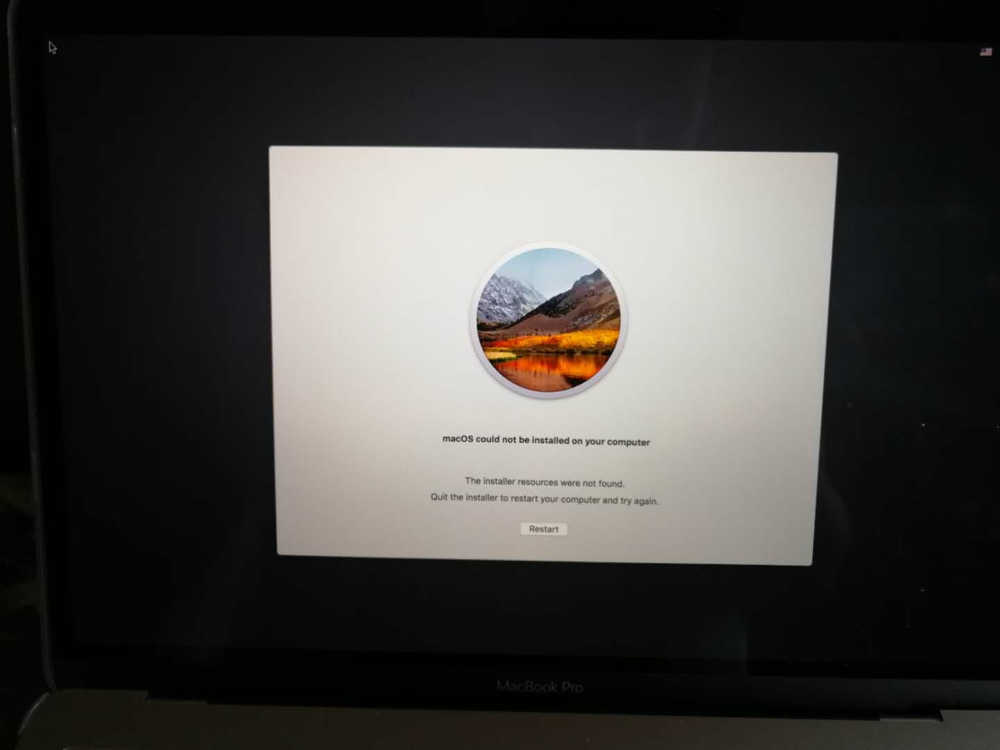
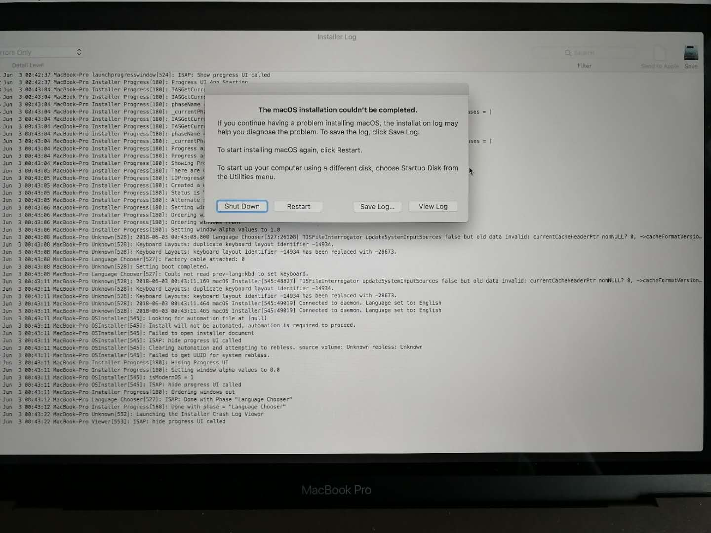
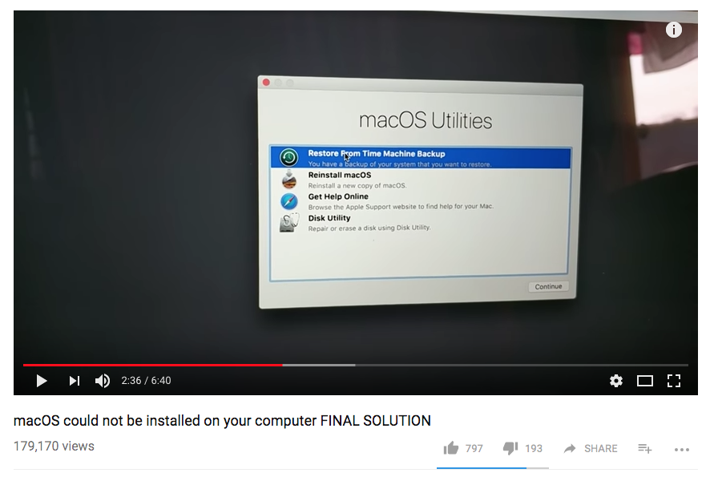
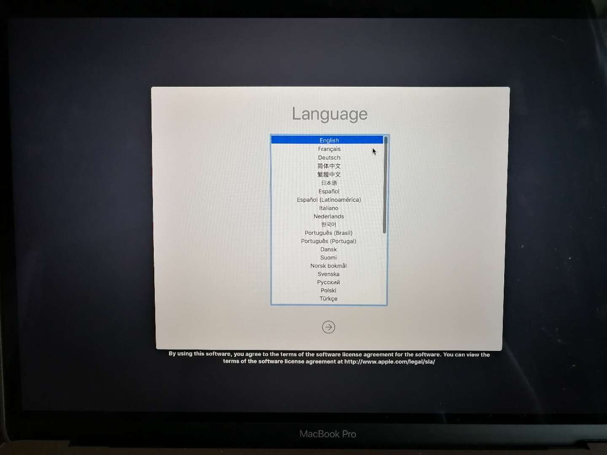
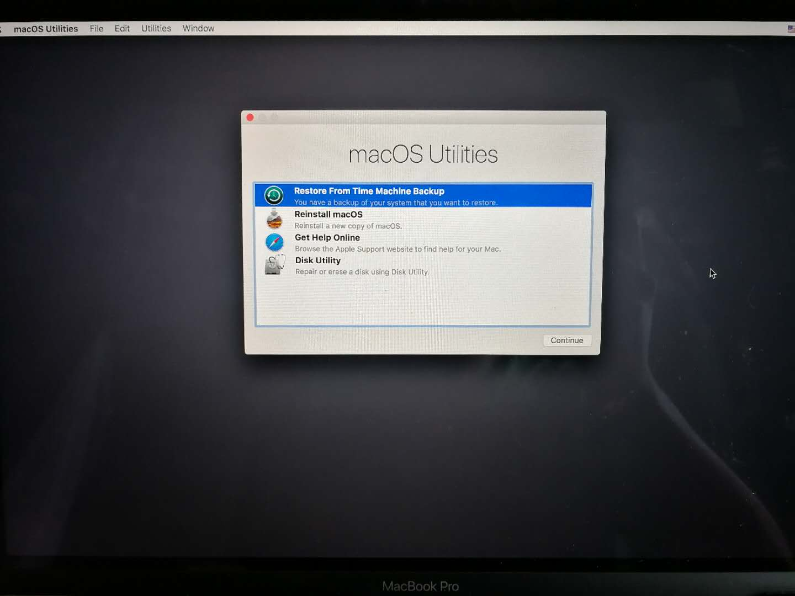
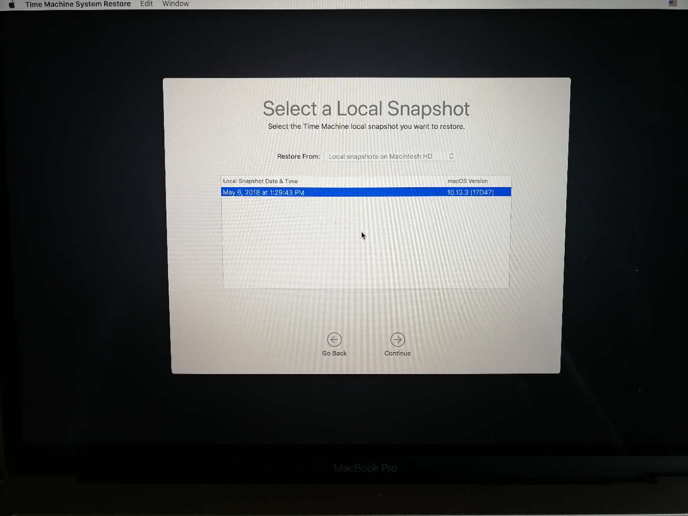

# Macbook启动出错 提示找不到系统 恢复历程

> 我是个电脑盲，哈哈

*2018-06-03*

### 启动出错，提示找不到系统，重启也是一样

### 联系京东Apple客服，给出了按键指引

### 同时参考了一则Youtube视频（他按的是'Cmd+R'）

视频：[macOS could not be installed on your computer FINAL SOLUTION](https://www.youtube.com/watch?v=gheoy07XNEU)

### 开机按住'Cmd+Opt+P+R'，从Backup恢复系统

