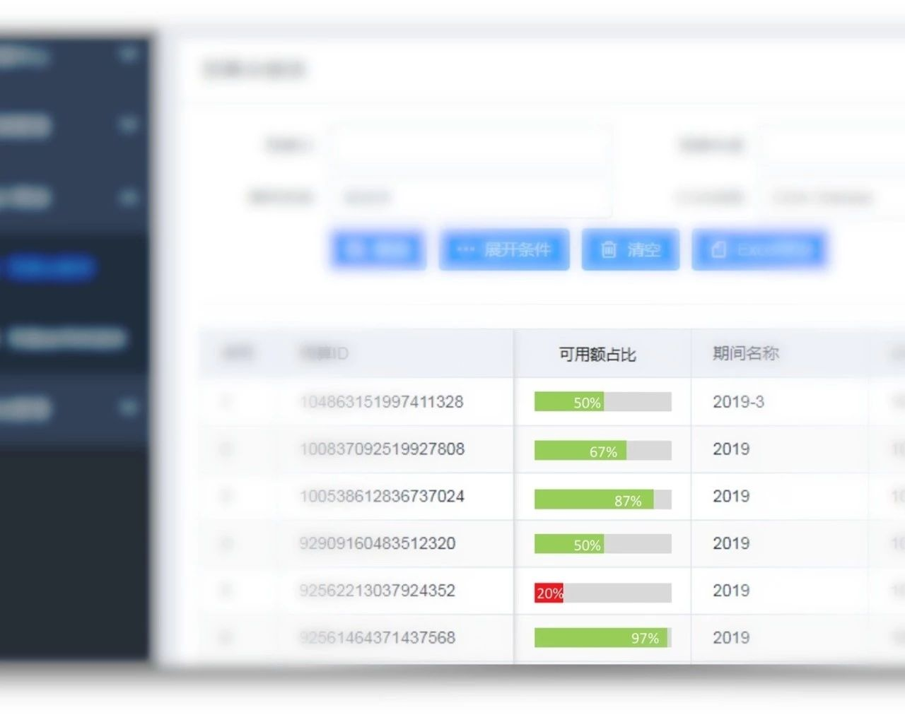
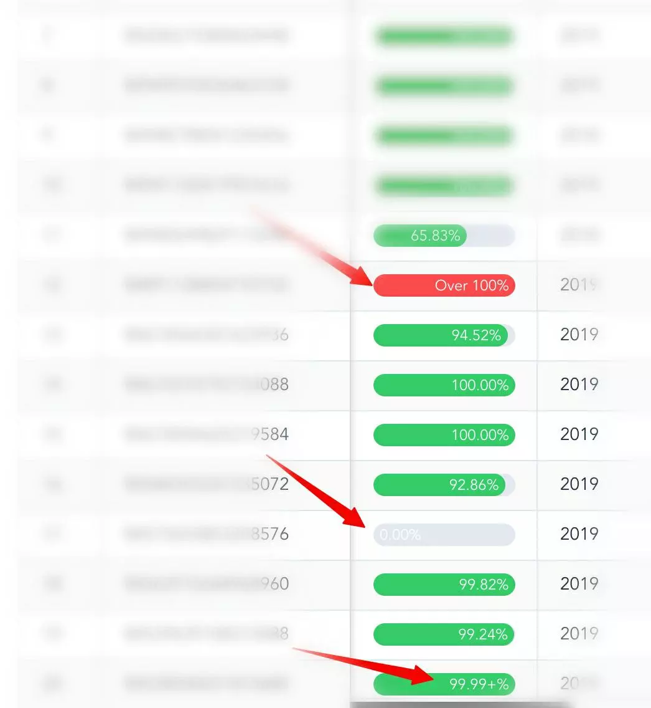

# el-progress percentage 精度优化 hack



*2019/03/08*

题图为优秀的 BA小哥 所做原型，仅作参考；实际样式还是遵循 Element-UI 规范，有所差异

历史遗留问题，项目明显基于 Element-UI 1.4，Vue 2.4，不喜勿喷，哈哈

```html
<fixed-table :schema="listSchema" :data="list.data">
  <!-- 表格中自定义列展示 "可用额占比"进度条 -->
  <template slot="column-percentage" scope="s">
    <budget-percentage :row="s.row"></budget-percentage>
  </template>
</fixed-table>
```

```html
<!-- BudgetPercentage.vue -->
<el-progress text-inside :stroke-width="18"
  :status="status" :percentage="percentage"></el-progress>
```

提取组件后，做了一些细致的工作：



1. 进度条样式

2. "可用额占比"计算公式

3. status 颜色，低于20%，高于100%，显示红色异常

4. 克服 el-progress 本身缺陷，实现百分比保留2位数字，此处"篡改"展示文字，动用了 dom-hack 及 ensureMounted 逻辑

5. 超出100%，展示文字"超出100%"

6. 克服四舍五入造成的 100%假象，没达到的"伪100%"，展示为"99.99+%"

```js
// BudgetPercentage.vue
// ...
computed: {
  // ...
  text () {
    if (this.value > 1) return this.$t('over.100%') // 超出100%异常
    let s = `${numberFormat(this.percentage, { d: 2 })}%`
    if (s === '100.00%' && this.value < 1) s = '99.99+%'
    return s
  },
  percentage () {
    let pct = this.value * 100
    pct = Math.max(0, pct)
    pct = Math.min(pct, 100)
    return pct
  },
},

watch: {
  value: {
    immediate: true,
    async handler () {
      await this.ensureMounted()
      // 等待多次nextTick 确保在 el-progress 自身更新逻辑之后
      await this.$nextTick()
      await this.$nextTick()
      await this.$nextTick()
      // hack 强行修改百分比文字展示 保留固定小数位/精度
      this.$el
        .querySelector('.el-progress-bar__innerText')
        .textContent = this.text
    }
  }
}
```

### 顺便讲讲 ensureMounted

在一个组件的任意时刻，如果依赖了 dom 即 依赖了 $el、$refs，那么它是不安全的；<br>
因为你无法保障任意时刻都在 mounted + 一次nextTick 之后

经过数次业务场景实践，我将 EnsureMounted 提为独立 mixin 以供复用；<br>
目前运行良好，但缺少独立成库+单元测试，先用着再说

```js
// BudgetPercentage.vue
// 应用
mixins: [EnsureMounted],

await this.ensureMounted()
this.$el // safe anywhere
this.$refs.xxx // safe anywhere
```

```js
// mixin/EnsureMounted.vue
// 实现
export default {
  data () {
    return {
      isMounted: false,
    }
  },
  async mounted () {
    await this.$nextTick()
    this.isMounted = true
    if (this.resolveMounted) {
      this.resolveMounted()
      delete this.resolveMounted
    }
  },
  methods: {
    ensureMounted () {
      return new Promise((resolve) => {
        if (this.isMounted) {
          resolve()
        } else {
          this.resolveMounted = resolve
        }
      })
    }
  },
}
```
