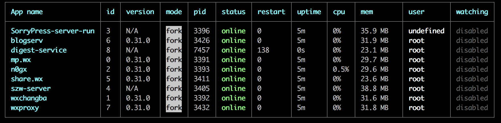
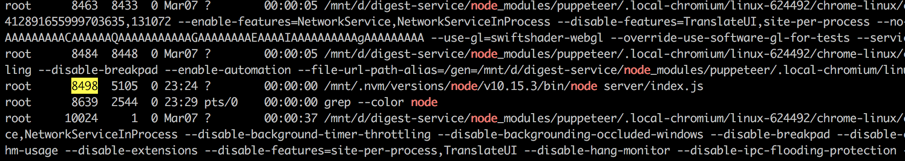
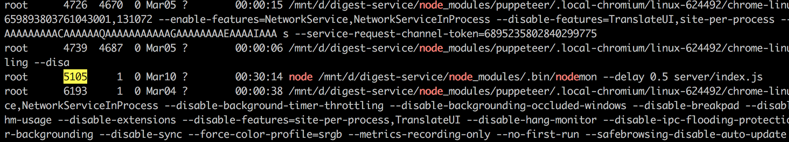

# 记一次端口占用排查

*2018/03/24*



吓人的玩意，这个问题我放很久了，最高的时候`restart`上万次。

```plain
# server-err-8.log
{ Error: listen EADDRINUSE: address already in use :::9102
    at Server.setupListenHandle [as _listen2] (net.js:1270:14)
  code: 'EADDRINUSE',
  errno: 'EADDRINUSE',
  syscall: 'listen',
  address: '::',
  port: 9102 }
```

查过日志，知道是`address already in use`，端口占用。

```sh
netstat -nlp | grep 9102
> tcp6  0  :::9102  :::*  LISTEN  8498/node

ss -tanp | grep n9102
> LISTEN  0 128 :::9102 :::*  users:(("node",8498,19))
```

最近习惯用上述两种命令，通过端口查进程，然后`kill`掉；<br>
但进程还是会换个马甲满血复活，让人摸不着头脑。

突然想起老久没用的`ps`大法：

```sh
# 列出所有包含`node`的进程及其父进程
ps -ef | grep node
```

Cmd+F，查找`8498`：



Cmd+F，查找`5015`：



```sh
# 是他
node /mnt/d/digest-service/node_modules/.bin/nodemon --delay 0.5 server/index.js
```

显然是我某次登上服务器，调试了下`npm run dev`，然后会话过期导致进程残留了。

```sh
# 杀掉这个罪魁祸首
kill 5105
```

问题解决。

#### 经验总结

- 果然`ps -ef`强大
- 进程复活，居然一直没有联想到`nodemon`
- 尽快使用`docker`等容器工具，取代或结合`pm2`
- 需要多学习服务器知识
- 如有疏漏，欢迎大佬指正
