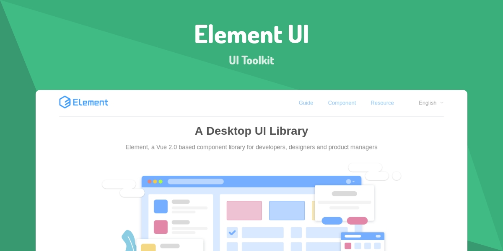
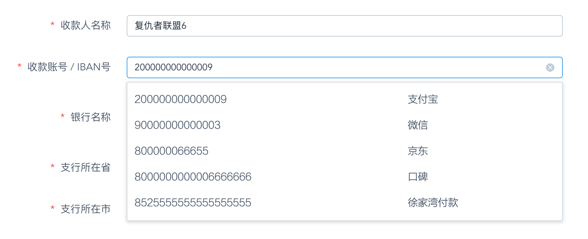

# 基于 Element-UI 的 可手输下拉组件



*2019/04/28*

### 背景

在 Element-UI 中，下拉组件有至少两种选择，

1. `<el-select>`
2. `<el-autocomplete>`

二者的区别是，

1. el-select 不支持手输，但支持过滤匹配（filterable），支持清除（clearable）
2. el-autocomplete 支持手输，却不支持清除

这里“手输”的意思是，用户自定义选项之外的值，简称“custom”

用法也不尽相同，

1. el-select 接受 options 数组，自定义模板需要加塞 slot
2. el-autocomplete 接受 fetch-suggestions 方法，自定义模板需要指定 custom-item

差异较大

### 问题

由于业务场景复杂度逐渐扩大，单个下拉框可能被要求在两种用法中切换，成本较大，

比如，我有可能在一个 computed 的 schema 中，通过 if-else 分支，

来给单个 field 赋值不同的类型以及对应的用法，

```js
if (this.allowCustomPatchFields) {
  // 外部供应商 特定开放 允许下拉+手填
  field.input = 'autocomplete'
  field.fetchSuggestions = this.filterAccountNo
  field.listen = {
    'select': () => { /* ... */ }
  }
} else {
  // 外部供应商 银行账号为SRM同步 下拉选项
  field.input = 'select'
  field.options = this.accountOptions
  field.listen = {
    'visible-change': visible => { /* ... */ }
  }
}
```

现在来了一个新需求，需要加入自定义模板，

如延续老路子，两边的分支差异将进一步扩大

### 解决

借着这次机会（不能让熵值再扩大），我决定梳理思路，实现一个统一的通用组件，解决此类业务场景，

即“具有一组下拉选项，且根据条件切换是否支持手输，并加入自定义模板”

**1\. 设立新的统一组件 CustomSelect，化解 if-else 分支**

```js
// 外部供应商 银行账号为SRM同步 下拉选项
field.input = 'CustomSelect'
field.customItem = 'BankAccountSelectItem'
field.allowCustom = this.allowCustomPatchFields
field.options = this.accountOptions
field.listen = {
  'select': () => {
    this.payeeAccountNoChange()
  }
}
```

经过对比，el-select 及 el-autocomplete，我选择基于后者及其用法（传参风格）来实现此组件，

原因是，虽然两者高度相似互通，但只有后者可以支持“手输”功能

**2\. CustomSelect 初步整合，基于 el-autocomplete，直接接收 options 数组**

大胆干掉 filterable，改为始终列出所有下拉选项（即使“手输”），原因是不展示全量选项，容易误导用户

```html
<el-autocomplete
  ref="input"
  v-model="innerModel"
  v-bind="$attrs"
  v-on="$listeners"
  :fetchSuggestions="fetchSuggestions"
></el-autocomplete>
```

```js
import { UiForm } from '@dxx/cms-uigen'

export default {
  name: 'CustomSelect',
  mixins: [UiForm.VModelMixin],
  props: {
    options: Array,
    value: String, // 暂时只支持string类型 因为关联输入框
  },
  methods: {
    fetchSuggestions (query, cb) {
      let filtered = this.options
      // 暂时取消输入过滤 否则易产生错觉
      cb(filtered)
    },
  }
}
```

**3\. 支持 allowCustom，可切换是否支持“手输”，hack 更新 input[readonly]**

el-autocomplete 及其内部 el-input 均不支持 readonly 属性，因此此处大胆借用 dom hack

```js
// ...
import EnsureMounted from '@/mixins/EnsureMounted'
​
export default {
  // ...
  mixins: [/* ... */, EnsureMounted],
  props: {
    // ...
    allowCustom: Boolean,
  },
  mounted () {
    this.updateInputReadonly()
  },
  computed: {
    inputReadonly () {
      return !this.allowCustom
    },
  },
  watch: {
    inputReadonly: 'updateInputReadonly'
  },
  methods: {
    async updateInputReadonly () {
      await this.ensureMounted()
      let input = this.$refs.input.$refs.input.$refs.input
      if (this.inputReadonly) {
        input.setAttribute('readonly', '')
      } else {
        input.removeAttribute('readonly')
      }
    },
  }
}
```

**4\. 向 el-select 模拟看齐，补充清除功能及小图标，根据 hover 状态切换**

虽然二者高度相似，但比起更常见的 el-select，el-autocomplete 缺少一些功能，如清除，

并且干脆默认 clearable=true（与 el-select 相反），利大于弊

因为多处地方并无坏处，然而某些地方清除功能很重要，如搜索栏，

如果选中了不被清除，则用户只能刷新界面清除（不可逆）

这里模拟 el-select 的细节包括

1. 如 clearable 为 true（默认），右侧展示”清除“小图标（按钮），点击可清除已有值
2. 如 clearable 为 false，右侧展示”下拉“小图标，点击触发展示下拉选项
3. 鼠标悬浮时，按钮动态在”下拉“和”清除“小图标之间切换

```html
<el-autocomplete
  ref="input"
  v-model="innerModel"
  v-bind="$attrs"
  v-on="$listeners"
  :icon="rightIcon"
  :on-icon-click="handleIconClick"
  :fetchSuggestions="fetchSuggestions"
  @mouseenter.native="isHover = true"
  @mouseleave.native="isHover = false"
></el-autocomplete>
```

```js
export default {
  // ...
  props: {
    clearable: {
      type: Boolean,
      default: true,
    },
  },
  data () {
    return {
      isHover: false,
    }
  },
  computd: {
    // ...
    showsClear () {
      return this.clearable && this.innerModel && this.isHover
    },
    rightIcon () {
      return this.showsClear ? 'circle-close' : 'caret-bottom'
    },
  },
  methods: {
    handleIconClick () {
      if (this.showsClear) {
        this.innerModel = ''
      } else {
        this.$refs.input.$refs.input.$emit('focus')
      }
    },
  },
}
```

最终效果如下


