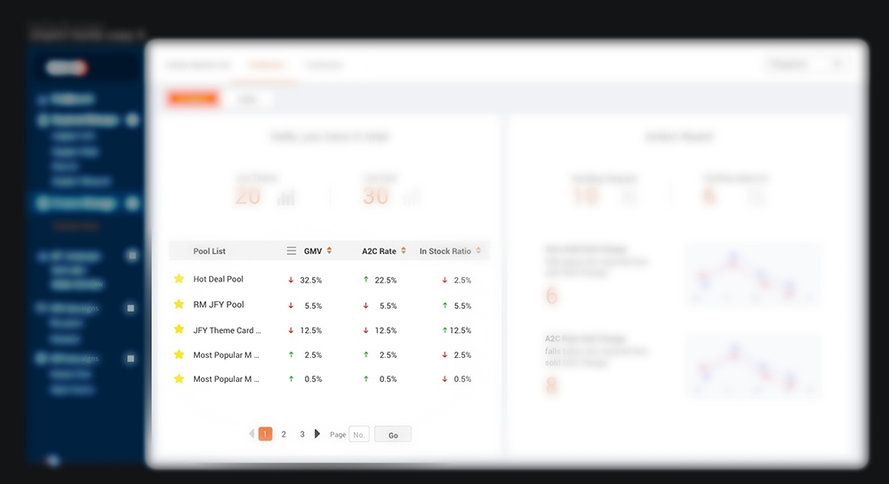
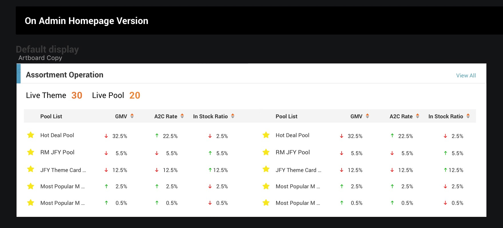

# React hooks 实现 “双列表格” 效果

_2020/04/10_

先看一眼设计稿（已虚化处理）：





图-1 中的普通表格，在图-2 中复用，并且变为“双列”展示

原有的 Table 传参：

```tsx
<PaginTable
  {...{
    // ...
    primaryKey,
    columns,
    dataSource,
    onSort,
  }}
/>
```

如果我们通过一个 `<SplitTable>` HOC 组件来实现<br>
那么会打破参数传递，变得复杂，侵入性强<br>
所以决定用 hooks 的方式来做

使用 useSplitTable 的 “双列 Table” 传参：<br>
只需将原有传参经过一层 hook 转换<br>
并补充相应的分列参数<br>
非常简单易用

```tsx
<PaginTable
  {...{
    // ...
    ...useSplitTable({
      newPageSize,
      newColumnCount,
      primaryKey,
      columns,
      dataSource,
      onSort,
    }),
  }}
/>
```

如此一来，衔接上可以说非常的无缝

那么 useSplitTable 要如何实现呢，下面就分步骤讲述一下：

1\. 入参

我们目前支持最基本的 primaryKey, columns, dataSource<br>
以及业务刚好用到 onSort<br>
以及分列参数 newPageSize, newColumnCount

```ts
interface OutputProps<T> {
  primaryKey: string;
  columns: TableColumn[];
  dataSource: T[];
  onSort: TableOnSort;
}
interface InputProps<T> extends OutputProps<T> {
  newPageSize: number;
  newColumnCount: number;
}

// eslint-disable-next-line @typescript-eslint/no-explicit-any
export let useSplitTable = <T = any>({
  newPageSize,
  newColumnCount,
  primaryKey,
  columns,
  dataSource,
  onSort,
}: InputProps<T>): OutputProps<T> => {
```

2\. 处理 dataSource

我们将原 dataSource，转化为分列后的 dataSource<br>
保留 Table 的展示逻辑，因此会将 “每 newColumnCount 条”记录合并为一条记录<br>
用 `${newColumnIndex}${sep}${k}` 来标识原记录的键名 k<br>
sep 暂且定位为双下划线 \_\_

```ts
let splittedDataSource = useMemo(() => {
  let arr: T[] = [];
  let len = dataSource.length;

  for (let i = 0; i < len; i++) {
    let newRowIndex = i % newPageSize;
    let newColumnIndex = Math.floor(i / newPageSize);

    let item = dataSource[i];
    let newPatch = {};
    Object.keys(item).forEach((k) => {
      newPatch[`${newColumnIndex}${sep}${k}`] = item[k];
    });
    let newExists = arr[newRowIndex];
    if (newExists) {
      Object.assign(newExists, newPatch);
    } else {
      // eslint-disable-next-line @typescript-eslint/no-explicit-any
      arr.push(newPatch as any);
    }
  }
  return arr;
}, [dataSource, newPageSize]);
```

3\. 处理 columns

与 dataSource 同理，columns 也做相应的变换<br>
取值方式做从 column.name 变换为 `${columnIndex}${sep}${column.name}`<br>
注意 item.cell 这个 render 函数 也要处理 把传参替换回原始的 record 格式

```ts
let splittedColumns = useMemo(() => {
  let arr: TableColumn[] = [];

  for (let i = 0; i < newColumnCount; i++) {
    columns.forEach((item) => {
      let newPatch = { ...item };
      newPatch.name = `${i}${sep}${item.name}`;
      if (item.cell) {
        newPatch.cell = (v, oi, or) => {
          let ni = oi + i * newPageSize;
          let nr = {};
          Object.keys(or)
            .filter((k) => _.startsWith(k, `${i}${sep}`))
            .forEach((nk) => {
              let ok = nk.split(sep)[1];
              nr[ok] = or[nk];
            });
          return item.cell && item.cell(v, ni, nr);
        };
      }
      arr.push(newPatch);
    });
  }
  return arr;
}, [columns, newPageSize, newColumnCount]);
```

4\. 处理 onSort

```ts
let splittedOnSort = useCallback(
  (dataIndex: string, order: SortOrder) => {
    dataIndex = dataIndex.split(sep)[1];
    return onSort(dataIndex, order);
  },
  [onSort]
);
```

5\. 处理 primaryKey

```ts
let splittedPrimaryKey = `0${sep}${primaryKey}`;
```

6\. 返回

```ts
return {
  primaryKey: splittedPrimaryKey,
  columns: splittedColumns,
  dataSource: splittedDataSource,
  onSort: splittedOnSort,
};
```

如果项目 React 版本 < 16.8 不支持 hooks 怎么办？

一次偶然发现的这个库 https://github.com/kingback/react-polyfills
