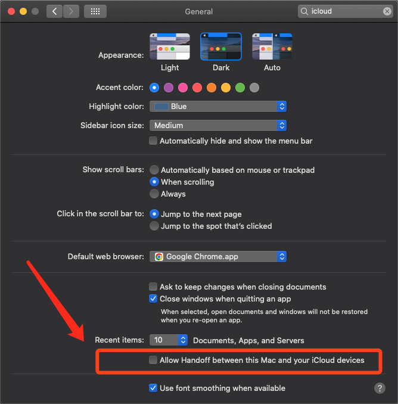

# 😡 什么神仙功能！🍎iCloud 的“接力”功能：“在设备之间传送网页”？

*#苹果 #Apple #iCloud #iPad #Mac #接力 #Handoff #信息安全 #个人隐私*

*2022-09-28*

> 妈妈再也不用担心，我正在浏览的🔞网页被传送到iPad上了

平时很少关注iPad，但在一个偶然的时刻，发现了一个严重的问题：

**我在Mac上正在浏览的网页，在iPad屏幕的右下角会有提示，并且可以直接打开**

**甚至是Safari之外的浏览器，比如日常使用的Chrome，依然无法幸免**

这就来到了文章的标题：😡 **这是什么神仙功能！What the Hell is that?!**

设想一下：你的家人正在使用你的iPad，而你登录着相同AppleID的Mac电脑上浏览着某些敏感网页

无论你用的是Chrome还是Safari，iPad的右下角能够一键打开你正在浏览的网页 😲

### 个人隐私安全

虽说早有耳闻苹果iCloud同步本身就不安全（如相片同步）

所以iCloud同步方面的个人隐私风险我早有控制（通过合理配置，结合个人日常使用方式）

比如我是关闭了相片同步，日常使用的是Android手机+Mac电脑，基本没有问题

### 如何解决

尝试过关闭iCloud同步中的“Safari数据”，无法解决

当我搜索"ipad safari can view mac"，终于得到了想要的结果

> **See the webpages open on your other devices in Safari on Mac** 
> View a webpage open on another device ... In the Safari app on your Mac, click iCloud Tabs in the sidebar. If the sidebar isn't shown, click the Sidebar button in ...

> 在 Mac 上的 Safari 浏览器中查看在其他设备上打开的网页 - 
《Safari 浏览器使用手册》 
> https://support.apple.com/zh-cn/guide/safari/sfri40726/mac

> 在 Mac 上使用“接力”回到上次离开的地方 - 
《macOS 使用手册》 
> https://support.apple.com/zh-cn/guide/mac-help/mchl732d3c0a/mac

阅读完相关文档后，终于弄清楚了这是个什么鬼👻，以及如何解决

### 打开或关闭“接力”
>【注】如果设备上没有出现接力选项，则该设备不支持接力。

> - 在您的 Mac 上：选取苹果菜单  >“系统偏好设置”，点按“通用” ，然后选择“允许在这台 Mac 和 iCloud 设备之间使用接力”（位于面板底部）。若要将其关闭，请取消选择该选项。

> - 在 iPad、iPhone 或 iPod touch 上：前往“设置”>“通用”>“隔空播放与接力”，然后打开或关闭“接力”。

> - 在 Apple Watch 上：在 iPhone 上的 Apple Watch App 中，前往“我的手表”>“通用”，然后打开或关闭“启用接力”。

在Mac点击左上角，打开系统设置，关闭这个什么狗屁 “接力”（“Handoff”）即可解决

