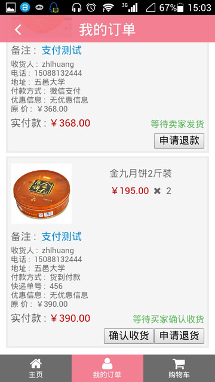

# emshop 江门邮政微商城

&nbsp;&nbsp;

> A fork of [mshop](../mshop/)

Another online shop(mall) highly adapted to mobiles

## Features

- Also as Real Products: [江门邮政电商](http://www.jmyzds.com/store), [Great Me](http://greatme.org) (Much Better on Mobile)
- PureCSS like Web Designing
- Highly Built with Gulp
- Completely Switched to Jade/JST

## Screenshots

&nbsp;

&nbsp;

&nbsp;

&nbsp;

&nbsp;

&nbsp;

## Wiki (in zh-CN)

See <https://github.com/fritx/emshop/wiki/1.-环境搭建>
