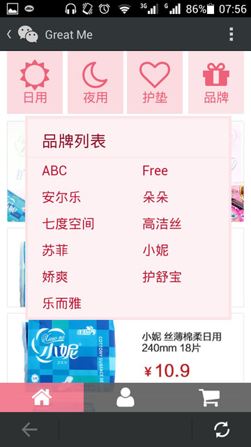
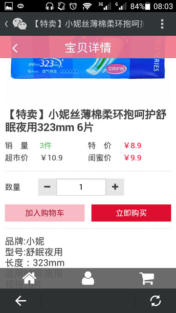
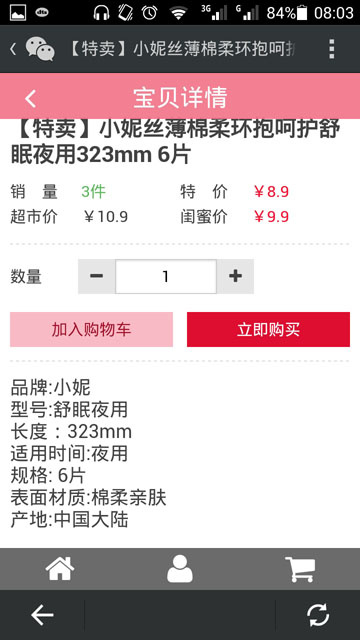
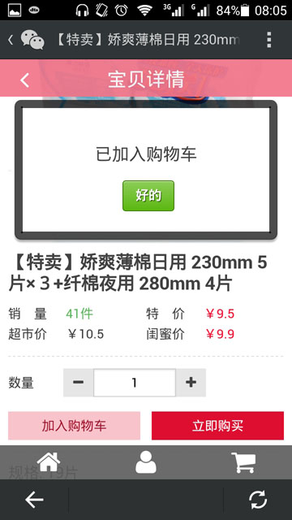
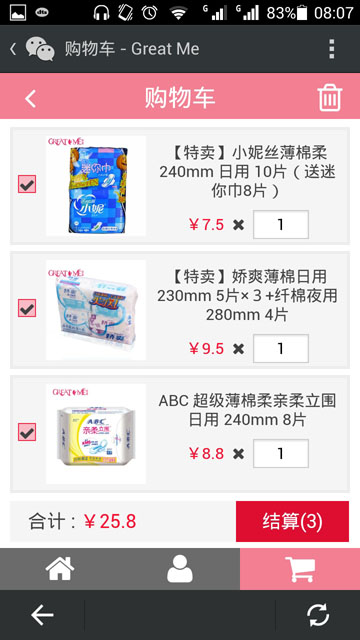
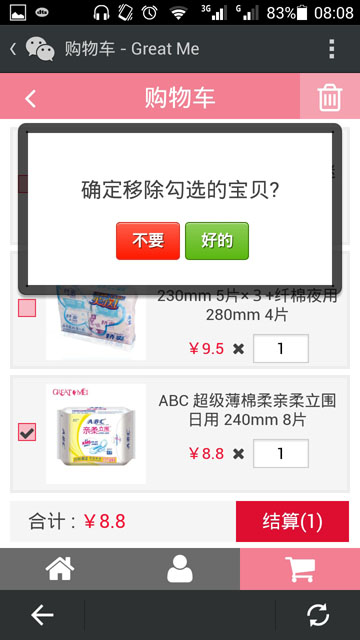
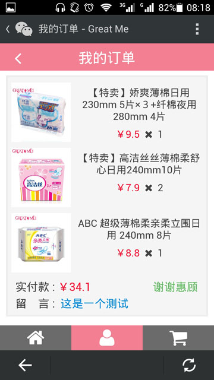

# 💁‍♀️ mshop 邑大闺蜜GreatMe专卖

&nbsp;&nbsp;

> An online shop adapted to mobile

## Features

- Also as a Real Product: [Great Me](http://greatme.org) (Much Better on Mobile)
- PureCSS like Web Designing
- JS-Driven Static Data-Reading
- Highly Built with Grunt
- Completely Switched to Jade/JST

## Screenshots

&nbsp;

&nbsp;

&nbsp;

&nbsp;

&nbsp;

&nbsp;

&nbsp;

&nbsp;

&nbsp;

&nbsp;

&nbsp;

&nbsp;

