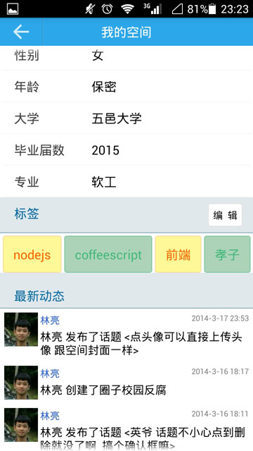
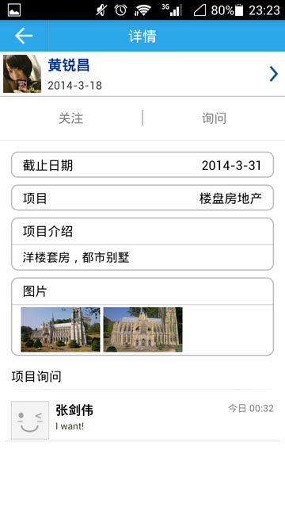
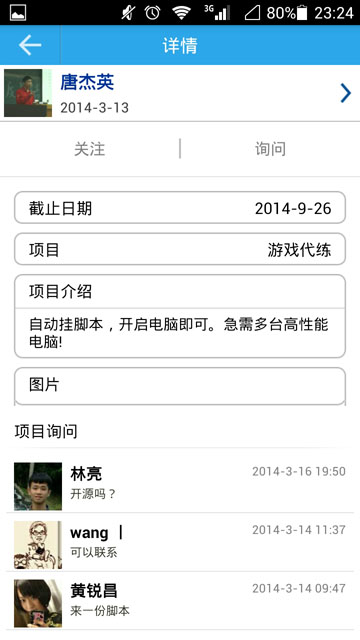

# siyuan - 思源校友群App

An SNS backend framework, with Node and MySQL

**Source code: <https://github.com/node-fun/siyuan>**

## Screenshots


&nbsp;

&nbsp;

&nbsp;



&nbsp;

&nbsp;

&nbsp;



&nbsp;

&nbsp;

&nbsp;

&nbsp;

## Install

1. Install Node and MySQL

1. Download or clone the repository

	```
	git clone git@github.com:node-fun/siyuan.git
	cd siyuan
	```

1. Install dependencies and Configure

	```
	npm install
	cp -r config.default config
	```

1. Setup the database

	```
	node setup [environment]
	```

	Usually, environment could be either `development`(default) or `production`.<br>
	Testing records come with a development mode.

## Run

```
node . [environment]
```

## Test

```
npm test
```
