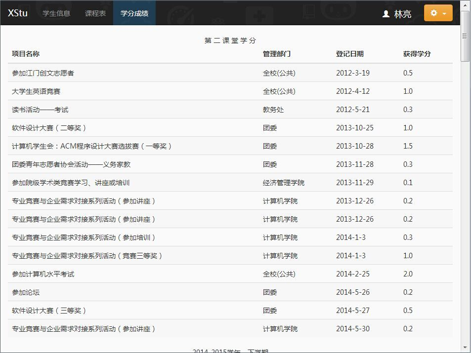

xstu 学生系统桌面客户端
====

A client version of **[WYU](https://github.com/WuyiUniversity) Student System**, based on NW.js (node-webkit)

&nbsp;&nbsp;

&nbsp;&nbsp;

&nbsp;&nbsp;

## Frameless Branch under Development

