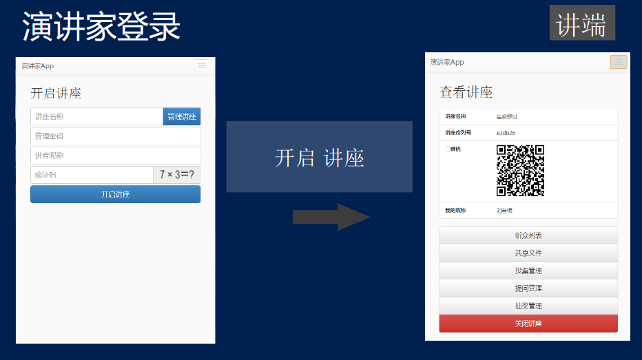
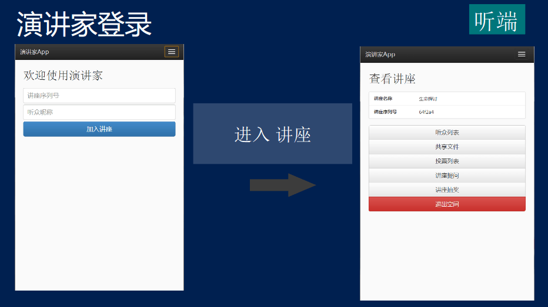
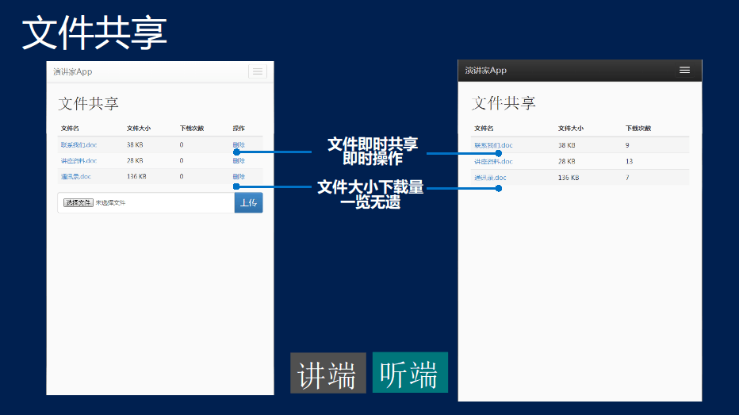
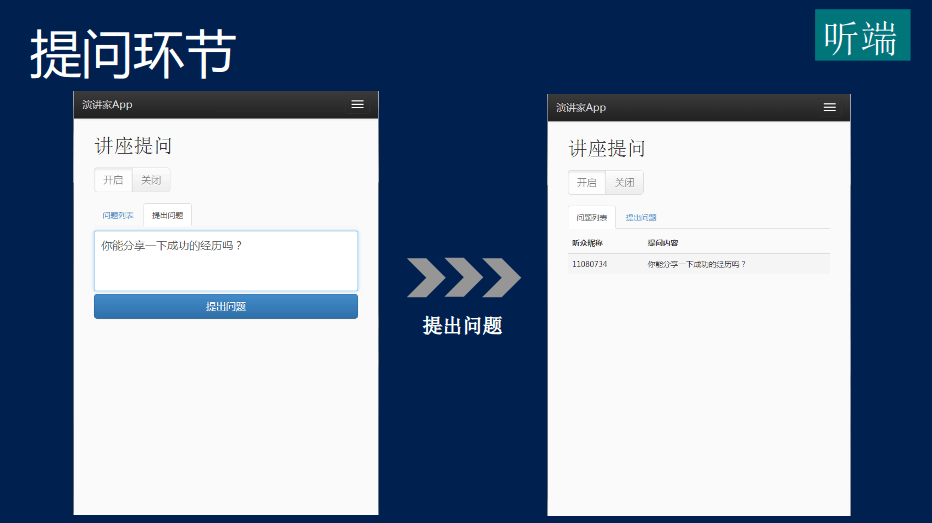
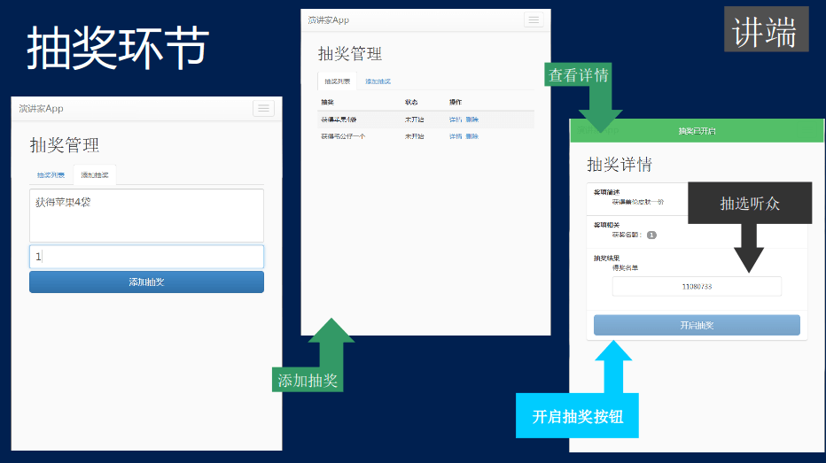

## 演讲家App

<a href="https://github.com/3dobe/yjjapp"></a>

一个连接讲端和听端，催化各类互动环节的演讲应用

- 3dobe, 2013软件设计大赛
- 16-308 @ WYU

在线演示: <http://yjjapp.3dobe.fritx.me>  
代码托管: <https://github.com/3dobe/yjjapp>

## 参赛资料

&nbsp;&nbsp;&nbsp;


&nbsp;&nbsp;&nbsp;


&nbsp;&nbsp;&nbsp;


&nbsp;&nbsp;&nbsp;


## 使用说明

1. 安装Node.js(v0.10.22以上) 网址 http://nodejs.org/
2. 命令行下进入该项目目录下
    ```plain
    $ cd yjjapp
    ```
3. 安装服务器端依赖库
    ```plain
    $ npm install
    ```
4. 安装Git 网址 http://www.git-scm.com/
5. 安装网页端依赖库
    ```plain
    $ npm install -g bower
    $ cd public
    $ bower install
    ```
6. 启动服务
    ```plain
    $ node app
    ```
7. 随后在浏览器打开 http://127.0.0.1:3088/ 进行浏览
