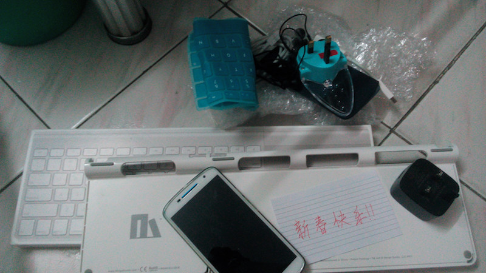

# 亮爷Weekly 0127



> 新春快乐!! -- 图为2016年(去年)春节锋哥寄给我的包裹📦

---

[0124] Vue表单控件自动生成 FieldGen组件  
由formSchema经由formHelper各方法 自动生成form的data/rules/layout  
避免手写大量重复代码 提高开发效率及展示一致性

```html
<template>
  <fieldset>
    <!-- hidden控件... -->
    <div v-for="row in layout.rows" class="form-group">
      <template v-for="(item, col) in row">
        <!-- 域标题label -->
        <label class="control-label"
          :class="labelCls(item, col)">
          {{item.title}}
          <em v-if="item.required">*</em>
        </label>
        <div :class="fieldCls(item, col)">
          <!-- 域值label -->
          <slot
            v-if="item.type === 'label'"
            name="label"
            :item="item">
            <span :class="spanCls(item)"
              v-text="getValue(data, item)"></span>
          </slot>
          <!-- 域值输入控件 -->
          <el-form-item v-else
            :prop="item.key">
            <!-- text (trim) -->
            <el-input
              v-if="item.input === 'text'"
              :placeholder="item.placeholder"
              v-model.trim="data[item.key]">
              <template v-for="key in ['prepend', 'append']">
                <template v-if="item[key]"
                  :slot="key">
                  {{item[key]}}
                </template>
              </template>
            </el-input>
            <!-- 其余更多input类型... -->
          </el-form-item>
        </div>
      </template>
    </div>
  </fieldset>
</template>
```

```js
// formHelper.js
// ...
export function getFormLayout (schema, displayLabel) {
  const hiddens = []
  const rows = [[]]
  schema.fields.forEach(field => {
    // ...
    if (shouldExpand) { // 独占一行
      rows.push([field])
      rows.push([])
    } else if (shouldBreak) { // 另起一行
      rows.push([field])
    } else {
      lastRow.push(field) // 正常插入
    }
  })
  return { hiddens, rows }
}
```

---

[0120] Vue CurrencyInput组件  
基于Element-UI el-input改造  
他们许多组件都还不够完善 需要自己定制

```html
<template>
  <el-input :value="myValue"
    @blur="handleBlur"
    @input="handleInput">
    <template v-if="$slots.prepend" slot="prepend">
      <slot name="preppend"></slot>
    </template>
    <template v-if="$slots.append" slot="append">
      <slot name="append"></slot>
    </template>
    <slot></slot>
  </el-input>
</template>
```

```js
handleBlur () {
  const oldVal = this.myValue
  const fmtVal = this.formatCurrency(this.myValue)
  if (fmtVal === oldVal) return
  this.myValue = fmtVal

  this.shouldWatchValue = false
  this.emitValue('change', fmtVal)

  this.$nextTick(() => {
    this.shouldWatchValue = true
  })
}
handleInput (val) {
  if (val === this.myValue) return
  this.myValue = val
  const fmtVal = this.formatCurrency(val)

  this.shouldWatchValue = false
  this.emitValue('input', fmtVal)

  this.$nextTick(() => {
    this.shouldWatchValue = true
  })
}
```

---

[1226] ajax借用iframe处理文件下载  
无意间发现的代码 有同学提到a元素click也可以

```js
function redirectToIframe (url) {
  let iframe = document.createElement('iframe')
  iframe.style.display = 'none'
  iframe.src = url
  iframe.onload = function () {
    document.body.removeChild(iframe)
  }
  document.body.appendChild(iframe)
}

// ...
Request(method, url)
  .end((err, res) => {
    // ...
    } else if (res.type === 'application/x-msdownload') {
      redirectToIframe(res.req.url)
    } else if (res.body) {
    // ...
  })
```

---

[1220] 当package中不包含npmignore文件  
有人来我的vue-at提issue 我发现当npmignore未定义  
npm会自作主张复制gitignore充当npmignore  
而导致我发布的package 意外地不包含dist目录  
https://github.com/fritx/vue-at/issues/1

---

[1207] 自动构建 偶发npm-cache rename EPERM  
https://github.com/npm/npm/issues/9696#issuecomment-194220960  
https://blogs.msdn.microsoft.com/matt-harrington/2012/02/23/how-to-fix-node-js-npm-permission-problems/

> 可以装最新的 node 4.x ，如果不装的话也可以直接更新npm 
`npm i -g npm@2.x`

```plain
17:16:42 npm ERR! Windows_NT 6.1.7601
17:16:42 npm ERR! argv "D:\\nodejs\\node.exe" "D:\\nodejs\\node_modules\\npm\\bin\\npm-cli.js" "i"
17:16:42 npm ERR! node v4.2.2
17:16:42 npm ERR! npm  v2.14.7
17:16:42 npm ERR! path C:\Windows\system32\config\systemprofile\AppData\Roaming\npm-cache\babel-helper-function-name\6.18.0\package\package.json.8a0e43e8df9892ae9e9846d3e8213947
17:16:42 npm ERR! code EPERM
17:16:42 npm ERR! errno -4048
17:16:42 npm ERR! syscall rename
17:16:42 
17:16:42 npm ERR! Error: EPERM: operation not permitted, rename 'C:\Windows\system32\config\systemprofile\AppData\Roaming\npm-cache\babel-helper-function-name\6.18.0\package\package.json.8a0e43e8df9892ae9e9846d3e8213947' -> 'C:\Windows\system32\config\systemprofile\AppData\Roaming\npm-cache\babel-helper-function-name\6.18.0\package\package.json'
17:16:42 npm ERR!     at Error (native)
```

---

[1202] 拓展marked 实现trello超链接效果 自动识别github-issues  
因为是blog 兼容要好 原始js+jq实现 痛苦！  
https://github.com/fritx/blog/commit/07d35413fa7ba1b1e317a212180ffff173310834

```js
var _link = renderer.link
renderer.link = function(href, title, text) {
  if (text === href) {
    var mat = href.match(/github\.com\/(.+)\/(.+)\/issues\/(\d+)(#(.+))?/)
    if (mat) {
      // var tx = mat[1] +'/'+ mat[2] +': Issue #'+ mat[3] // trello
      var tx = mat[1] +'/'+ mat[2] +'#'+ mat[3] // github
      if (mat[5]) tx += ' (comment)'
      var $a = $('<a>').text(tx)
        .attr({
          'class': 'known-service-link',
          href: href,
          title: title
        })
      var $icon = $('')
        .attr({
          'data-noop': '',
          'class': 'known-service-icon',
          src: 'p/github.png'
        })
      $a.prepend($icon)
      return $a.prop('outerHTML')
    }
  }
  return _link.call(renderer, href, title, text)
}
```

```css
.known-service-link {
  color: #444;
  background: #D6DADC;
  border-radius: 3px;
  padding: 2px 4px;
}
.known-service-icon {
  width: 14px;
  height: 14px;
  margin-right: 3px;
  vertical-align: middle;
}
```
